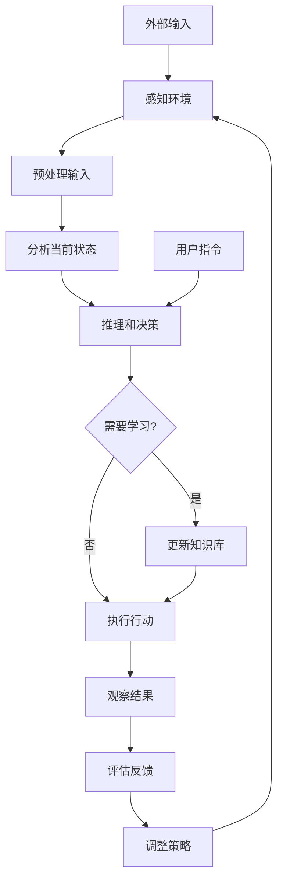

# AI Agent 概述

AI Agent（人工智能代理）是能够自主感知环境、进行推理并采取行动以实现目标的自主人工智能系统。它们可以是简单的（反应式）或复杂的（具有记忆、规划和学习能力）。

## 关键特性
- **自主性**：无需持续人工监督即可独立运行
- **目标导向**：朝着特定目标工作
- **适应性**：根据经验学习并调整行为
- **互动性**：与人类和其他代理进行沟通和协作

## AI Agent 的工作原理

AI Agent 通过感知-推理-行动循环（Sense-Reason-Act Cycle）来运作：

1. **感知（Perception）**：收集来自环境的输入信息
2. **推理（Reasoning）**：分析信息、制定计划并做出决策
3. **行动（Action）**：执行决策并与环境互动
4. **学习（Learning）**：从结果中学习并改进性能

这个循环是连续的，使代理能够适应变化的环境。

## 处理流程

以下是 AI Agent 的典型处理流程图：

**流程说明**：
- **感知环境**：收集传感器数据、用户输入或其他信息
- **预处理输入**：清理和格式化数据
- **分析当前状态**：理解环境和自身状态
- **推理和决策**：基于知识和目标做出选择
- **学习更新**：根据经验改进性能
- **执行行动**：与环境互动
- **评估反馈**：分析行动结果
- **调整策略**：优化未来行为

## AI Agent 类型

根据复杂度和能力，AI Agent 可以分为以下类型：

- **简单反射代理**：仅对当前感知做出反应，无记忆或规划
- **基于模型的代理**：维护内部环境模型，支持更复杂的决策
- **基于目标的代理**：考虑未来后果，规划多步行动
- **基于效用的代理**：最大化预期效用，选择最优行动
- **学习代理**：通过经验改进性能，支持持续学习

## 应用场景

AI Agent 在多个领域有广泛应用：

### 自动化任务
- 客户服务聊天机器人
- 智能家居控制系统
- 工业自动化监控

### 决策支持
- 金融交易助手
- 医疗诊断辅助
- 供应链优化

### 探索与发现
- 科学研究助手
- 数据分析代理
- 创意内容生成

### 协作系统
- 多代理团队协作
- 虚拟助手集成
- 游戏中的非玩家角色

## 主流代理开发框架

以下是构建 AI Agent 的主流第三方框架：

### LangChain / LangGraph
- **简介**：由 LangChain Inc. 开发的开源框架，提供模块化的代理构建工具
- **特点**：支持多种 LLM、工具集成、链式调用、RAG（检索增强生成）
- **适用场景**：文档分析、聊天机器人、数据处理管道
- **GitHub Stars**：100k+
- **链接**：https://github.com/langchain-ai/langchain

### AutoGPT
- **简介**：自主 AI 代理的先驱项目，能够自我提示和执行多步任务
- **特点**：目标驱动、任务分解、自动网络搜索和文件操作
- **适用场景**：自动化研究、内容创作、代码生成
- **GitHub Stars**：150k+
- **链接**：https://github.com/Significant-Gravitas/AutoGPT

### CrewAI
- **简介**：多代理协作框架，模拟团队工作流程
- **特点**：角色定义、任务委派、代理间通信
- **适用场景**：企业工作流自动化、内容团队、项目管理
- **GitHub Stars**：30k+
- **链接**：https://github.com/CrewAI Inc/CrewAI

### AutoGen
- **简介**：微软开发的多代理对话框架
- **特点**：可定制代理、对话式交互、工具调用
- **适用场景**：复杂问题解决、代码生成、研究辅助
- **GitHub Stars**：35k+
- **链接**：https://github.com/microsoft/autogen

### LlamaIndex
- **简介**：专注于数据增强的代理框架
- **特点**：高效数据索引、RAG 优化、多模态数据处理
- **适用场景**：知识库构建、文档问答、私有数据集成
- **GitHub Stars**：45k+
- **链接**：https://github.com/run-llama/llama_index

### Semantic Kernel
- **简介**：微软的 AI 编排框架，支持多种编程语言
- **特点**：插件架构、语义函数、跨平台支持
- **适用场景**：企业应用集成、智能助手、业务流程
- **GitHub Stars**：20k+
- **链接**：https://github.com/microsoft/semantic-kernel

### 框架对比

| 框架 | 多代理支持 | 工具集成 | 学习曲线 | 社区活跃度 |
|------|-----------|---------|---------|-----------|
| LangChain | 中 | 丰富 | 中 | 非常高 |
| AutoGPT | 低 | 基础 | 低 | 高 |
| CrewAI | 高 | 中 | 低 | 高 |
| AutoGen | 高 | 中 | 中 | 高 |
| LlamaIndex | 低 | 丰富 | 中 | 高 |
| Semantic Kernel | 中 | 丰富 | 中 | 中 |

### 选择框架的考量因素
- **项目复杂度**：简单任务可选轻量级框架，复杂任务需要功能全面的框架
- **多代理需求**：如需多个代理协作，优先考虑 CrewAI 或 AutoGen
- **数据集成**：需要 RAG 或知识库时，LlamaIndex 是好选择
- **团队技能**：考虑团队的技术栈和经验水平
- **长期维护**：选择活跃社区和定期更新的框架

## 挑战与未来发展

### 当前挑战
- **可解释性**：理解代理的决策过程
- **安全性**：防止有害行为和数据泄露
- **可扩展性**：处理复杂环境和高并发
- **伦理问题**：确保公平和负责任的使用

### 未来趋势
- **多模态代理**：整合文本、图像、语音等多种输入
- **自主学习**：更先进的自适应和元学习能力
- **人机协作**：无缝集成人类智能和AI能力
- **边缘计算**：在设备端运行高效代理

AI Agent 代表了人工智能发展的前沿，随着技术的进步，它们将在更多领域发挥关键作用。