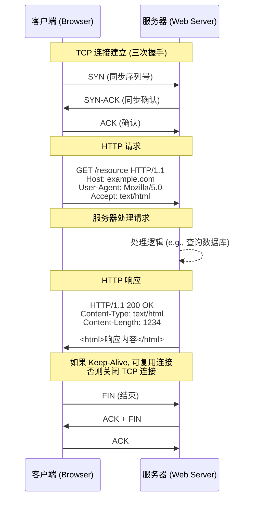
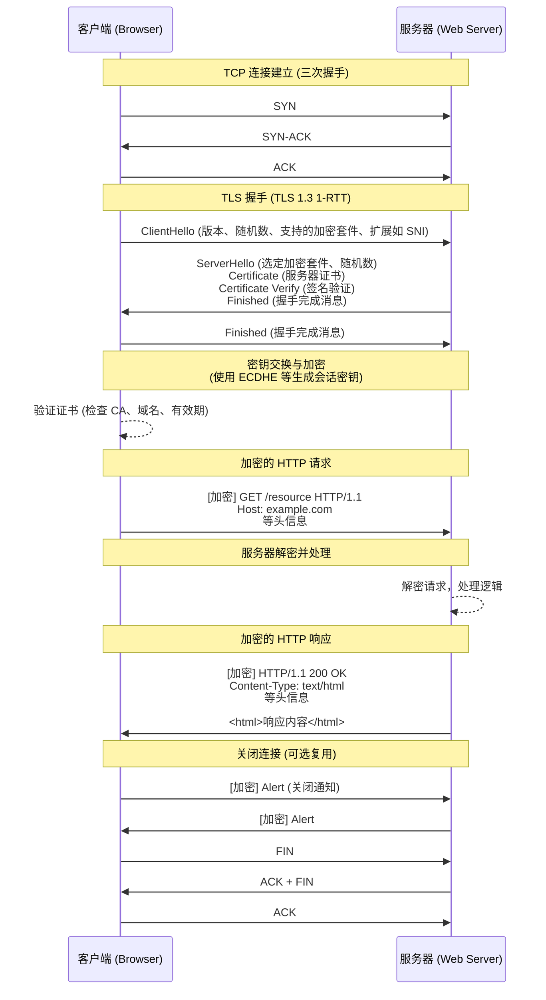

HTTP（HyperText Transfer Protocol，超文本传输协议）是一种用于分布式、协作式和超媒体信息系统的应用层协议。它是万维网（World Wide Web）数据通信的基础，最初由蒂姆·伯纳斯-李（Tim Berners-Lee）于1989年在CERN提出。HTTP 是无状态的（stateless），意味着服务器不保留客户端的任何状态信息，每个请求都是独立的。

#### 主要特点
- **基于请求-响应模型**：客户端（通常是浏览器）向服务器发送请求，服务器返回响应。
- **传输层协议**：HTTP 通常基于 TCP/IP 协议栈，使用 TCP 作为传输层，确保可靠传输。
- **端口**：默认使用 80 端口。
- **无连接**：HTTP/1.0 默认是无连接的（每个请求建立一个新连接），但 HTTP/1.1 引入了持久连接（Keep-Alive），允许多个请求复用同一个 TCP 连接。
- **明文传输**：所有数据（包括请求头、响应头和正文）都是明文，容易被窃听或篡改。

#### HTTP 版本演进
- **HTTP/0.9**（1991）：最简单版本，仅支持 GET 方法，用于传输纯文本 HTML。
- **HTTP/1.0**（1996）：引入请求头、响应头、状态码、POST 方法等，支持 MIME 类型，但每个请求都需要新连接。
- **HTTP/1.1**（1997，至今主流）：添加持久连接、管道化（pipelining）、缓存机制、Host 头（支持虚拟主机）、Chunked 传输等。解决了 HTTP/1.0 的头阻塞问题，但仍有队头阻塞（HOL blocking）问题。
- **HTTP/2**（2015）：基于 SPDY 协议，二进制分帧、多路复用、头部压缩、服务器推送等特性，提高了性能。仍基于 TCP。
- **HTTP/3**（2022）：基于 QUIC 协议（UDP 基础），解决了 TCP 的队头阻塞问题，支持 0-RTT 连接恢复，进一步提升速度和可靠性。

#### 请求与响应结构
- **请求（Request）**：
  - **请求行**：方法 + URL + 版本（e.g., GET /index.html HTTP/1.1）
  - **请求头**：键值对，如 Host: example.com, User-Agent: Mozilla/5.0, Accept: text/html 等。
  - **空行**：分隔头和体。
  - **请求体**：可选，用于 POST/PUT 等方法携带数据（如表单）。

- **响应（Response）**：
  - **响应行**：版本 + 状态码 + 状态短语（e.g., HTTP/1.1 200 OK）
  - **响应头**：如 Content-Type: text/html, Content-Length: 1234, Set-Cookie: session=abc 等。
  - **空行**。
  - **响应体**：实际内容，如 HTML、JSON 等。

#### 常见方法（Methods）
- GET：获取资源（幂等、安全）。
- POST：提交数据（非幂等）。
- PUT：更新资源（幂等）。
- DELETE：删除资源（幂等）。
- HEAD：类似 GET，但只返回头。
- OPTIONS：查询支持的方法。
- PATCH：部分更新资源。

#### 状态码（Status Codes）
- 1xx：信息性（e.g., 100 Continue）。
- 2xx：成功（e.g., 200 OK, 201 Created）。
- 3xx：重定向（e.g., 301 Moved Permanently, 302 Found）。
- 4xx：客户端错误（e.g., 400 Bad Request, 404 Not Found）。
- 5xx：服务器错误（e.g., 500 Internal Server Error, 503 Service Unavailable）。

#### 其他机制
- **缓存**：通过 Cache-Control、ETag、Last-Modified 等头实现，减少重复请求。
- **Cookie**：用于状态管理，服务器通过 Set-Cookie 发送，客户端在后续请求中携带。
- **CORS**：跨域资源共享，允许不同域的资源访问。
- **代理与网关**：支持代理服务器（Proxy）转发请求。

### HTTPS 协议详细介绍

HTTPS（HyperText Transfer Protocol Secure，安全超文本传输协议）是 HTTP 的安全版本，通过在 HTTP 和 TCP 之间添加 SSL/TLS 层来实现加密和身份验证。HTTPS 于1994年由 Netscape 引入，主要用于保护敏感数据传输，如登录凭证、支付信息等。

#### 主要特点
- **加密传输**：使用对称加密（数据传输）和非对称加密（密钥交换），防止中间人攻击（MITM）。
- **身份验证**：通过数字证书（CA 颁发）验证服务器身份，防止伪造。
- **完整性**：使用 MAC（Message Authentication Code）确保数据未被篡改。
- **端口**：默认使用 443 端口。
- **性能开销**：TLS 握手增加延迟，但现代优化（如 TLS 1.3 的 0-RTT）已显著减少。
- **强制使用**：许多浏览器（如 Chrome）标记 HTTP 为不安全，推动 HTTPS 普及。

#### HTTPS 与 HTTP 的区别
- HTTPS = HTTP + TLS/SSL。
- HTTP 是明文，HTTPS 是加密的。
- HTTPS 需要证书，HTTP 不需要。
- HTTPS 更安全，但稍慢（握手开销）。

#### TLS/SSL 协议
- **SSL**（Secure Sockets Layer）：早期版本（1.0-3.0），已弃用。
- **TLS**（Transport Layer Security）：SSL 的继任者，当前版本 TLS 1.3（2018）。
  - TLS 1.2：支持 ECDHE 密钥交换、SHA-256 等。
  - TLS 1.3：简化握手（1-RTT）、移除弱加密、强制前向保密（PFS）。

#### 证书与 CA
- **数字证书**：包含公钥、域名、有效期等，由 CA（如 Let's Encrypt、DigiCert）签发。
- **证书链**：根 CA -> 中间 CA -> 服务器证书。
- **验证过程**：客户端检查证书的有效性、签名和域名匹配。

### 数据交换流程图

以下使用 Mermaid 绘制 HTTP 和 HTTPS 的详细数据交换流程图。我将分别绘制 HTTP 的基本流程和 HTTPS 的完整流程（包括 TLS 握手）。这些是序列图（sequenceDiagram），展示了客户端与服务器之间的交互。

#### 1. HTTP 数据交换流程图
这是一个典型的 HTTP/1.1 请求-响应流程，包括 TCP 三次握手。

#### 2. HTTPS 数据交换流程图
HTTPS 流程在 HTTP 基础上添加 TLS 握手。以下是 TLS 1.3 的简化 1-RTT 握手流程。

这些流程图展示了核心交互。对于更复杂的场景（如 HTTP/2 的多路复用），可以进一步扩展。如果需要调整图表细节或更多版本的比较，请提供更多指定！