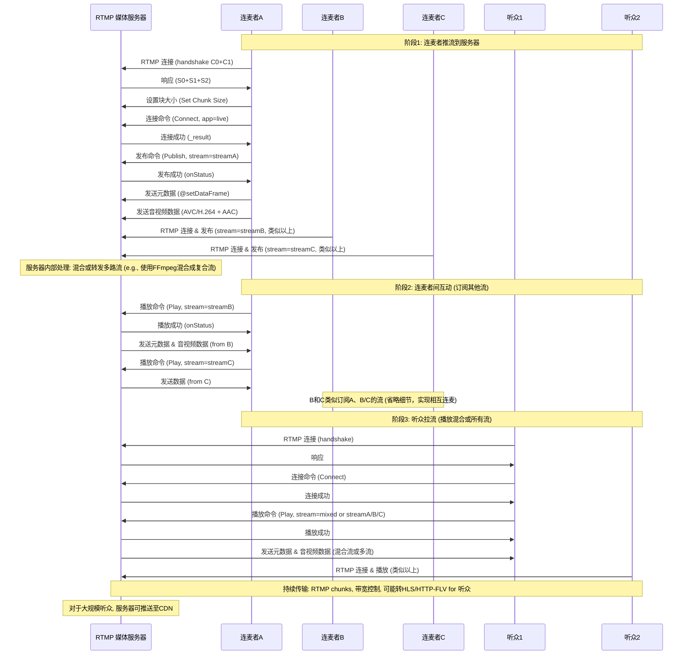

您问了一个非常关键的协议。**RTMP (Real-Time Messaging Protocol)** 在直播和流媒体传输领域有着举足轻重的地位，尤其是在**推流（Ingest）** 环节。

### 什么是 RTMP？

**RTMP** 的全称是 **Real-Time Messaging Protocol**（**实时消息传输协议**）。

* **开发者：** 最初由 Adobe（前身为 Macromedia）公司开发，主要用于在 Flash 播放器和服务器之间传输实时音频、视频和数据。
* **用途：** 它是目前直播行业中，**主播端**（编码器）向**媒体服务器**推送直播流（即“推流”）时使用**最广泛**的协议之一。
* **基础：** RTMP 协议通常基于 **TCP** 协议之上，默认使用端口 **1935**。

### 🎨 RTMP 的设计思路和核心机制

RTMP 的设计目标是为了在不可靠的公共互联网上实现**低延迟**、**稳定可靠**的流媒体传输。它的核心设计思路体现在以下几个方面：

#### 1. 基于 TCP 的可靠性（Reliability over TCP）

* RTMP 建立在 TCP 协议之上。TCP 提供面向连接、可靠的字节流服务，确保发送方发出的所有数据包都能按序、完整地到达接收方，这对于保证视频和音频流的**连续性和质量**至关重要。
* **设计思路：** 利用 TCP 的可靠性机制，避免在应用层重复实现复杂的丢包重传逻辑。

#### 2. 分块（Chunking）机制 

这是 RTMP 最核心的机制之一。

* **背景：** 视频、音频和控制消息（如播放/暂停指令）在 RTMP 中被称为**消息（Message）**。这些消息的大小不一，可能很大（如一个视频关键帧）或很小（如一个音频采样）。
* **机制：** RTMP 将每个消息切分成一个个固定大小的**块（Chunk）**。常用的 Chunk 大小是 128 字节，但可以协商调整。
* **设计思路：**
    * **低延迟：** 对于较大的视频帧，不需要等到整个帧编码完成才发送，而是可以切分成小块**边编码边发送**，从而显著降低端到端的延迟。
    * **多路复用：** 不同的流（视频流、音频流、控制信令流）的消息块可以交错发送，在同一 TCP 连接上高效地复用带宽。

#### 3. 多媒体复用与同步（Multiplexing and Synchronization）

* RTMP 协议定义了消息的**格式**，包括消息类型（视频、音频、数据、命令等）、**流 ID** 和**时间戳**。
    * **流 ID：** 允许在同一个 TCP 连接上承载多路逻辑流，例如在连麦场景中，主播和嘉宾的音视频流可以通过同一个 RTMP 连接传输。
    * **时间戳：** 用于精确同步视频和音频数据，确保在播放端音画同步，这是直播体验的关键。
* **设计思路：** 确保音视频数据能在接收端被正确地、同步地重组和播放。

#### 4. 持久连接和会话管理

* RTMP 在客户端和服务器之间建立一个**持久的连接**。在正式传输数据之前，客户端和服务器会进行一个**“握手”**（Handshake）过程，用于确认协议版本和初始化连接参数。
* **设计思路：** 避免了 HTTP 那种“请求-响应”模式下每次请求都建立新连接的开销，有利于实时通信和长期稳定的流传输。

### 总结 RTMP 的优缺点

| 特点 | 描述 |
| :--- | :--- |
| **优点** | **低延迟：** 由于其分块机制和持久连接，RTMP 的延迟表现非常好，适合对实时性要求较高的推流场景。 |
| | **成熟稳定：** 经过多年的应用，技术栈成熟，兼容性好（在编码器侧）。 |
| **缺点** | **兼容性差（拉流侧）：** 现代浏览器（如 Chrome、Firefox）已经停止原生支持 Flash Player，这意味着观众端不能直接通过浏览器播放 RTMP 流。 |
| | **传输协议限制：** 基于 TCP，可能会受到 TCP 自身的拥塞控制机制影响，且在网络环境极差时效率不如基于 UDP 的协议（如 SRT）。 |
| | **穿墙能力弱：** 默认端口 1935 容易被防火墙阻挡，不如基于 HTTP 的协议（如 HLS、HTTP-FLV）容易利用 80/443 端口穿透。 |

因此，在当前的直播架构中，**RTMP** 仍然是**推流**的首选，但媒体服务器通常会将 RTMP 流**转码**为 **HLS** 或 **HTTP-FLV**，再分发给观众端观看。