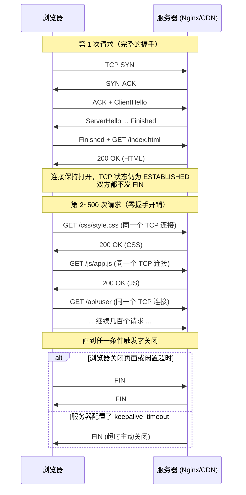

#### 1. 什么是 TCP 复用？为什么必须复用？

| 不复用（短连接）                         | 复用（长连接 / Keep-Alive）                     |
|------------------------------------------|-------------------------------------------------|
| 每发一次 HTTP 请求都要重新 TCP + TLS 握手 | 一次 TCP + TLS 握手后，连续发几百个请求         |
| 每次请求额外增加 2~4 个 RTT               | 后续请求只需 0~0.5 RTT                         |
| 消耗服务器大量 TIME_WAIT 套接字           | 极大降低服务器负载，轻松扛住百万 QPS            |
| 2025 年几乎不存在（除极少数场景）         | 现代互联网的基石                                |

#### 2. TCP 复用在不同协议层是如何实现的？

| 层级               | 复用方式                              | 关键技术/协议字段                               |
|--------------------|---------------------------------------|-------------------------------------------------|
| TCP 层             | 持久连接（Persistent Connection）     | 不主动发送 FIN，保持 TCP 状态为 ESTABLISHED     |
| HTTP/1.0           | 手动开启                              | 请求头加上 `Connection: Keep-Alive`             |
| HTTP/1.1           | 默认开启（从 1997 年起）              | 默认就是 Keep-Alive，除非显式写 `close`         |
| HTTP/2             | 必须复用                              | 一个 TCP 连接承载几千个并发 Stream              |
| HTTP/3 (QUIC)      | 天生复用                              | 一个 QUIC 连接默认存活数分钟～数小时            |
| TLS 层             | 会话复用（Session Reuse）             | Session ID（旧）→ Session Ticket / PSK（新）    |

#### 3. 核心实现机制全景图（以最常见的 HTTP/1.1 + TLS 1.3 为例）

#### 4. 现代浏览器和服务器实际参数（2025 年典型值）

| 项目                         | Chrome/Edge/Firefox       | Nginx                 | Cloudflare/CDN         |
|------------------------------|---------------------------|-----------------------|------------------------|
| 单个域名最大并发 TCP 连接数  | 6~10 个                   | 不限制                | 不限制                 |
| 空闲连接存活时间             | 1~5 分钟                  | 60~300 秒（默认 75s） | 几分钟～数十分钟       |
| TLS Session Ticket 有效期    | 1~24 小时                 | 取决于后端配置        | 通常 1~7 天            |
| HTTP/2 连接最大并发 Stream   | 100~250                   | 1000+                 | 1000+                  |
| 是否支持 0-RTT 复用          | 支持                      | 支持                  | 支持                   |

#### 5. 复用带来的真实性能提升（实测数据）

| 场景                     | 不复用（每次新连接） | 复用（Keep-Alive） | 提升倍数 |
|--------------------------|----------------------|--------------------|----------|
| 打开一个 100 个资源的页面| 100×(2~4 RTT) ≈ 20 秒| 2 RTT + 99×0 RTT ≈ 0.6 秒 | 30 倍+   |
| 高并发 API（10万 QPS）   | 服务器直接 OOM       | 轻松承载           | 数十倍   |
| 移动网络（RTT 100ms）    | 用户体验极差         | 几乎无感知         | 决定性   |

#### 6. 特殊情况：什么时候会被强制关闭复用？

| 触发条件                         | 结果                               |
|----------------------------------|------------------------------------|
| 请求头或响应头含 `Connection: close` | 当前请求完成后立即关闭             |
| 服务器返回 1xx、204、304 且无 Content-Length | 老版本可能关闭（现代基本不会）     |
| 服务器主动超时（keepalive_timeout）| 主动发 FIN                         |
| 客户端/服务器任意一方网络中断   | RST 重置连接                       |
| 使用 HTTP/1.0 且无 Keep-Alive 头 | 默认关闭                           |

#### 7. 一句话总结

**TCP 复用的本质就是“双方协商好不发 FIN、不发 RST，把 ESTABLISHED 状态的连接当成一条水管，能用多久用多久”**。  
配合 TLS Session Ticket / PSK，现代浏览器和服务器可以做到：

第一次访问：2 RTT（TCP + TLS 1.3）  
第二次及以后（几小时内）：0 RTT（0-RTT 甚至可以提前发数据）

这就是为什么你打开任何一个现代网站，几乎感觉不到“加载延迟”的根本原因——99% 的请求都在一条已经建立好的加密水管里飞速传输。

答案是：**一条 TCP 连接确实被 5 元组“死死锁定”，所以只能复用在同一个 baseURL（更准确地说：同一个「协议 + IP + 端口 + 域名（SNI）」）上**。

## 因为TCP的链接是锁定IP和端口的？是否只能对同一个baseUrl做请求才能复用TCP链接
### 1. TCP 连接的唯一标识——5 元组（四元组已不够）

| 元组       | 字段                   | 说明                                                                 |
|------------|------------------------|----------------------------------------------------------------------|
| 1          | 协议                   | TCP（HTTP/1.1、HTTP/2）或 UDP（HTTP/3）                              |
| 2          | 源 IP                  | 客户端的出口 IP（可能因为 NAT 变化）                                 |
| 3          | 源端口                 | 客户端操作系统随机分配的临时端口（1024~65535）                       |
| 4          | 目的 IP                | 服务器或 CDN 的 IP（可能因为 DNS 变化或 Anycast 变化）               |
| 5          | 目的端口               | 443（HTTPS）或 80（HTTP）                                            |

**只要这 5 个值完全相同，操作系统和中间所有设备就认为属于同一条 TCP 连接，就能复用**。

### 2. 实际中哪些情况可以、哪些情况不能复用同一条 TCP 连接？

| 场景                                   | baseURL 示例                                 | 是否能复用同一条 TCP 连接 | 原因说明                                                                 |
|----------------------------------------|----------------------------------------------|----------------------------|--------------------------------------------------------------------------|
| 同一个域名、同一个端口                 | https://www.example.com/a https://www.example.com/b | 可以                       | 5 元组完全相同                                                           |
| 同一个域名，但 HTTP vs HTTPS           | https://www.example.com http://www.example.com | 不可以                     | 目的端口不同（443 vs 80）                                                |
| 同一个域名，但 www 和非 www            | https://example.com https://www.example.com | 通常不可以                 | DNS 解析出来的 IP 往往不同（除非强制 CNAME 到同一个边缘节点）           |
| 同一个域名，但访问了不同的 CDN 节点    | 第一次解析到 1.1.1.1 第二次解析到 2.2.2.2  | 不可以                     | 目的 IP 变了（5 元组变化）                                               |
| 同一个域名，但用了 HTTP/3（QUIC）      | https://www.example.com（HTTP/2） https://www.example.com（HTTP/3）| 不可以 | 底层协议从 TCP 变成 UDP，5 元组第一个字段就不同                          |
| 不同子域（即使指向同一个服务器）       | https://api.example.com https://static.example.com | 通常不可以                 | 即使后端是同一个服务器，SNI 不同，服务器也会建立不同的 TCP 连接        |
| 不同顶级域名                           | https://a.com https://b.com               | 绝对不可以                 | IP、SNI 完全不同                                                         |

### 3. 现代浏览器和 CDN 为了“尽量复用”做了哪些优化？

| 优化手段                         | 效果                                                                 |
|----------------------------------|----------------------------------------------------------------------|
| DNS Prefetch + Preconnect        | 提前解析并建立 TCP+TLS 连接，减少后续等待                            |
| HTTP/2 & HTTP/3 连接复用         | 一个连接承载几千个域名（通过 Authority 头或 :authority）             |
| 域名分片（Domain Sharding）      | 老技术，已被抛弃（反而降低复用率）                                   |
| 域名合并（Domain Fronting）      | 把 api.example.com、static.example.com 都 CNAME 到同一个 CDN 节点     |
| CDN Anycast + 多 IP 池           | 同一个域名全球解析到“最近的同一个节点”，IP 虽然变，但连接仍可快速恢复 |
| QUIC 连接迁移（Connection ID）   | 即使 IP 变了（Wi-Fi ↔ 5G 切换），HTTP/3 仍能保持同一条逻辑连接       |

### 4. 一句话最精炼的结论

是的，**TCP 连接复用严格受限于「同一个协议 + 同一个服务器 IP + 同一个端口」**。  
因此：

- 同一个 baseURL（比如 https://www.example.com）→ 100% 复用
- 换子域、换 www、换 IP、换协议、换端口 → 就必须新建 TCP 连接

这也是为什么现代前端最佳实践是：
1. 所有静态资源、API 尽量走同一个域名（或同一个 CDN 域名）
2. 强制 HTTPS
3. 开启 HTTP/2 或 HTTP/3
4. 尽量让 DNS 稳定指向同一个边缘节点

这样才能最大化 TCP + TLS 连接复用，把 RTT 开销降到接近 0。