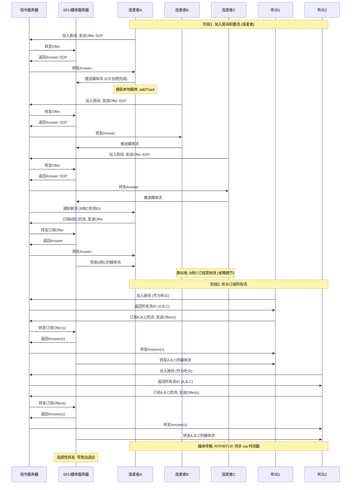

## 引言

WebRTC（Web Real-Time Communication）是一种开源技术框架，旨在实现浏览器和移动应用之间的实时音视频通信和数据传输，而无需安装插件或第三方软件。它由谷歌于2011年开源，目前已成为W3C（World Wide Web Consortium）和IETF（Internet Engineering Task Force）的标准。WebRTC的核心目标是简化实时通信的开发，使开发者能够轻松构建视频会议、在线教育、远程医疗和直播互动等应用。

在现代互联网中，WebRTC已成为不可或缺的一部分。根据Statista的数据，到2025年，全球视频会议市场规模预计将超过500亿美元，其中WebRTC扮演着关键角色。它支持点对点（P2P）连接，同时可与服务器结合处理复杂场景，如多方连麦和大规模广播。

本文将详细介绍WebRTC的架构、关键组件、工作原理、安全机制以及应用场景。最后，我们将使用Mermaid绘制的流程图展示一个典型的三人连麦场景（涉及多个听众），以可视化方式阐释其工作流程。

## WebRTC的核心组件

WebRTC并非单一协议，而是一套API和协议的集合，主要包括以下组件：

### 1. **API层**
   - **getUserMedia()**：用于获取用户的摄像头、麦克风或屏幕共享的媒体流（MediaStream）。例如，在JavaScript中调用`navigator.mediaDevices.getUserMedia({ video: true, audio: true })`来捕获本地视频。
   - **RTCPeerConnection**：核心对象，用于管理两个对等方之间的连接。它处理媒体协商、数据传输和网络穿越。开发者可以通过`addTrack()`添加媒体轨道，通过`createOffer()`和`createAnswer()`生成SDP（Session Description Protocol）描述。
   - **RTCDataChannel**：用于传输任意数据，如文本聊天、文件共享或游戏状态，支持可靠（TCP-like）或不可靠（UDP-like）模式。

### 2. **协议栈**
   - **RTP/RTCP**：实时传输协议（Real-time Transport Protocol）和其控制协议，用于媒体数据的打包和传输。RTP携带时间戳和序列号，确保顺序播放；RTCP提供反馈，如丢包率和延迟，用于质量控制。
   - **SDP**：会话描述协议，用于协商媒体参数，如编解码器（VP8、H.264、Opus）、分辨率和带宽。
   - **ICE（Interactive Connectivity Establishment）**：用于网络穿越，包括STUN（Session Traversal Utilities for NAT）和TURN（Traversal Using Relays around NAT）。STUN帮助发现公网IP，TURN作为中继服务器处理防火墙问题。
   - **DTLS/SRTP**：数据传输层安全（Datagram Transport Layer Security）和安全RTP，确保媒体流的加密和完整性。

### 3. **服务器角色**
   - **信令服务器（Signaling Server）**：WebRTC不定义信令机制，开发者需自定义（如使用WebSocket）。它负责交换SDP和ICE候选，协调连接建立。
   - **媒体服务器**：对于多方场景，如SFU（Selective Forwarding Unit）或MCU（Multipoint Control Unit）。SFU转发流而不混合，适合低延迟；MCU混合流成复合视频，适合大规模广播。

## WebRTC的工作原理

WebRTC的工作流程可分为信令、连接建立和数据传输三个阶段。

### 1. **信令阶段**
   信令是WebRTC的“握手”过程，用于交换元数据。典型流程：
   - 用户A创建RTCPeerConnection，生成Offer SDP（描述本地能力）。
   - 通过信令服务器发送Offer给用户B。
   - 用户B生成Answer SDP，返回给A。
   - 双方交换ICE候选（潜在连接路径）。

   信令不传输媒体，仅控制信号，通常基于HTTP、WebSocket或SIP。

### 2. **连接建立阶段**
   - **ICE协商**：使用STUN服务器发现公网地址。如果直连失败，转用TURN中继。
   - **媒体协商**：通过SDP确定共同支持的编解码器和参数。
   - 一旦连接建立（ICE状态变为“connected”），媒体流开始传输。

### 3. **数据传输阶段**
   - 媒体数据通过UDP-based RTP传输，支持带宽自适应（BWE - Bandwidth Estimation）和丢包恢复（NACK/FEC）。
   - 对于多流同步，使用RTP时间戳和RTCP报告调整缓冲，确保唇音同步。

在多方场景中，如三人连麦，引入SFU：每个参与者推送流到SFU，SFU选择性转发给他人。听众只订阅流，不推送。

## WebRTC的安全机制

安全是WebRTC的核心设计原则：
- **加密**：所有媒体使用SRTP加密，密钥通过DTLS协商。
- **权限控制**：浏览器提示用户授予媒体访问权限。
- **身份验证**：可集成WebAuthn或OAuth到信令中，防止未授权接入。
- **漏洞防护**：定期更新浏览器以修复如ICE洪水攻击的风险。

尽管如此，开发者需注意信令服务器的安全，避免 SDP 注入或中间人攻击。

## WebRTC的应用场景

WebRTC广泛应用于：
- **视频会议**：如Zoom、Google Meet，使用WebRTC实现多方互动。
- **直播和连麦**：Twitch或Bilibili的互动直播，观众可加入连麦。
- **远程协作**：屏幕共享和数据通道用于在线教育或远程医疗。
- **IoT和游戏**：实时数据传输，如无人机控制或多人游戏。
- **新兴应用**：结合WebAssembly，实现AR/VR实时通信。

优势包括低延迟（<200ms）、跨平台和开源，但挑战在于网络兼容性和大规模扩展（需云服务器）。

## WebRTC的挑战与未来

挑战：
- **网络问题**：NAT穿越失败率约10-20%，需TURN服务器。
- **浏览器兼容**：Safari对某些编解码器支持有限。
- **资源消耗**：高分辨率视频需强大硬件。

未来：WebRTC NV（Next Version）将支持AV1编解码器和更好的AI集成，如背景虚化。5G的普及将进一步降低延迟，推动元宇宙应用。

## 三人连麦与多个听众的WebRTC流程图

以下使用Mermaid绘制的序列图，展示一个三人连麦（UserA、UserB、UserC作为连麦者）和两个听众（Audience1、Audience2）的完整流程。假设使用SFU媒体服务器和信令服务器。流程包括加入房间、推流、订阅和媒体转发。

此流程图展示了信令协调、SFU转发的核心逻辑。实际实现中，可添加错误处理和断线重连。

## 结语

WebRTC彻底改变了实时通信的格局，使其从专有软件转向开放web标准。随着技术的演进，它将继续驱动创新。如果您是开发者，建议从WebRTC官方样本代码入手，构建简单应用以实践其强大功能。