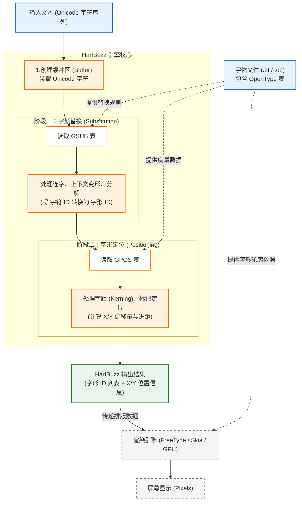

**HarfBuzz** 是一个开源的**文本塑形引擎（Text Shaping Engine）**。

它是现代软件显示文本的基础设施之一。简单来说，当你看到屏幕上显示的文字（无论是浏览器、操作系统界面还是设计软件）看起来排列整齐、连写正确时，背后很可能就是 HarfBuzz 在工作。

以下是关于 HarfBuzz 的详细解析：

---

### 1. 核心概念：什么是“文本塑形” (Text Shaping)？

要理解 HarfBuzz，首先必须区分两个概念：
*   **字符 (Character):** 计算机存储的抽象代码（例如 Unicode 编码 `U+0061` 代表字母 `a`）。
*   **字形 (Glyph):** 屏幕上实际看到的视觉图形（字体文件中画好的那个 `a` 的样子）。

**文本塑形**就是**将 Unicode 字符序列转换为字形序列，并确定它们位置的过程**。

在简单语言（如英语）中，这似乎很简单（一个字符对应一个字形）。但在复杂语言（如阿拉伯语、印地语）或高级排版中，字符和字形之间**不是**一对一的关系，位置也极其复杂。HarfBuzz 就是专门处理这种复杂转换的工具。

---

### 2. HarfBuzz 的主要功能

HarfBuzz 的核心任务是正确地“选字”和“摆放”。

#### A. 字形替换 (Glyph Substitution - GSUB)
它根据上下文将字符替换为正确的字形：
*   **连字 (Ligatures):** 在英文中，将 `f` + `i` 替换为一个连体字形 `fi`。
*   **上下文变形:** 在阿拉伯语中，同一个字母根据它在单词的开头、中间还是结尾，会有完全不同的写法。HarfBuzz 会自动选择正确的字形。
*   **分解与组合:** 处理像 `é` 这样的字符，它可能是一个单独的字形，也可能是 `e` 加上重音符号 `´` 组合而成的。

#### B. 字形定位 (Glyph Positioning - GPOS)
它计算每个字形在屏幕上的精确 X/Y 坐标：
*   **字距调整 (Kerning):** 调整特定字母对之间的间距（例如 `A` 和 `V` 靠得更近，看起来更美观）。
*   **标记定位 (Mark Positioning):** 确保元音符号、重音符号精确地“悬浮”在基础字母的上方或下方（这对泰语、希伯来语至关重要）。
*   **草书连接:** 确保手写体风格的字体中，笔画是连续不断的。

#### C. 跨语言/脚本支持
它是目前世界上对 Unicode 脚本支持最完善的引擎之一，支持：
*   **拉丁语系、西里尔语系**（主要处理连字和字距）。
*   **阿拉伯语、叙利亚语**（处理从右向左的书写和复杂的上下文变形）。
*   **印度语系**（如天城文，涉及复杂的字符重排，元音符号可能出现在辅音之前）。
*   **东亚语言**（处理竖排文本等）。

---

### 3. HarfBuzz 的工作原理

HarfBuzz 的工作流程可以简化为以下几个步骤：

#### 输入 (Input)
1.  **文本流:** 一串 Unicode 字符。
2.  **字体文件:** 包含字形数据和 OpenType 表（规则表）的文件（如 .ttf 或 .otf）。
3.  **参数:** 语言（如 English）、脚本（如 Latin）、方向（如 LTR 从左到右）。

#### 处理流程 (The Pipeline)
1.  **缓冲区 (Buffer):** HarfBuzz 将输入的 Unicode 字符放入一个缓冲区。
2.  **选择塑形器 (Shaper Selection):** HarfBuzz 内部有针对不同脚本的逻辑（例如 `ot` 是通用的 OpenType 塑形器，也有专门针对阿拉伯语的逻辑）。
3.  **应用 OpenType 表 (Applying Tables):**
    *   **GSUB 阶段:** 引擎读取字体文件中的 **GSUB 表**。它扫描缓冲区，根据规则将“字符 ID”替换为“字形 ID”。（例如：发现序列 `L` `a` `m` `A` `l` `e` `f`，替换为 `Lam-Alef` 合体字形）。
    *   **GPOS 阶段:** 引擎读取字体文件中的 **GPOS 表**。它计算每个字形的 `x_advance`（宽度）、`y_advance`（高度）、`x_offset`（水平偏移）和 `y_offset`（垂直偏移）。

#### 输出 (Output)
HarfBuzz **不负责画图**（不产生像素）。它输出的是一组数据，交给渲染引擎（如 FreeType, Skia, DirectWrite）：
*   **字形索引 (Glyph Indices):** 告诉渲染器“去字体文件里拿第 105 号图片”。
*   **位置信息 (Positions):** 告诉渲染器“把这张图片画在坐标 (x, y) 处”。

---

### 4. 总结与类比

如果把在屏幕上显示文字比作**印刷报纸**：

*   **Unicode 字符:** 是记者的**手稿**。
*   **字体文件 (Font):** 是印刷厂的**铅字库**。
*   **FreeType (渲染引擎):** 是最后的**油墨印刷机**，负责把图案印在纸上。
*   **HarfBuzz (塑形引擎):** 是经验丰富的**排版工人**。
    *   他知道手稿里的 "fi" 应该拿 "fi连字" 的铅块，而不是两个分开的铅块（GSUB）。
    *   他知道 "A" 和 "V" 放在一起时要稍微挤紧一点（GPOS）。
    *   他把所有铅块排好位置，然后告诉印刷机（FreeType）：“照着这个位置印”。

### 谁在使用 HarfBuzz？
几乎所有现代软件：
*   **浏览器:** Google Chrome, Mozilla Firefox, Microsoft Edge.
*   **操作系统:** Android, Linux (GNOME/KDE/Pango), ChromeOS.
*   **应用:** LibreOffice, Photoshop, Telegram.
*   **开发库:** Qt, Flutter, Skia.

它是目前全球文字渲染事实上的工业标准。