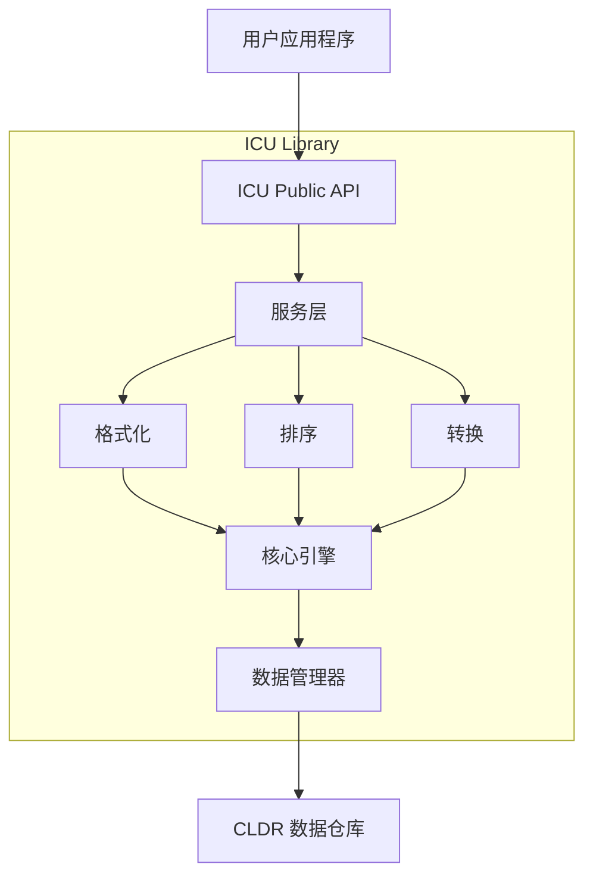
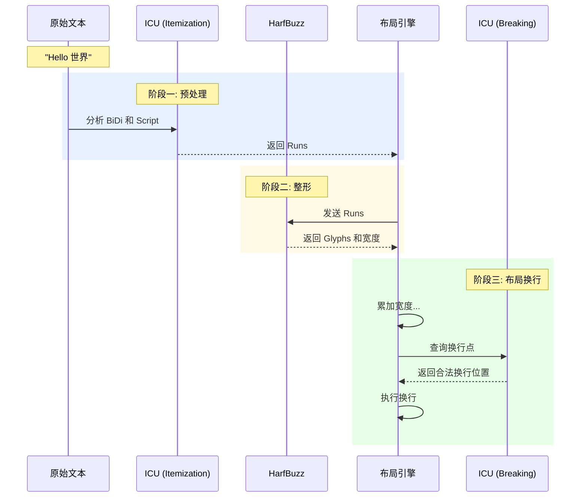

# 

## 一、ICU 简介

**ICU (International Components for Unicode)** 是一个成熟、广泛使用的开源库，专门用于软件的**国际化 (Internationalization, i18n)** 和**本地化 (Localization, l10n)**。它是实现跨语言、跨地区文本处理的事实行业标准解决方案。

### 1.1 核心作用

Unicode 标准仅定义了字符的编码，而 ICU 的作用是实现这些字符的处理逻辑。ICU 主要解决以下核心问题:

1. **文本转换 (Code Page Conversion)**
   - 在 Unicode 和传统字符集(如 GB2312, ISO-8859-1, Shift-JIS)之间进行转换

2. **排序 (Collation/Sorting)**
   - 根据特定语言环境(Locale)实现正确的排序规则
   - 例如: 德语中 "ö" 可能被视为 "oe"，而在瑞典语中它是字母表的最后一个字母

3. **格式化 (Formatting)**
   - **数字与货币**: `1,234.56` (美国) vs `1.234,56` (德国)
   - **日期与时间**: `2023年10月5日` (中国) vs `05/10/2023` (英国)
   - **复数规则**: 处理不同语言的复杂复数形式

4. **文本边界分析 (Text Boundary Analysis)**
   - 在无空格分隔的语言(如中文、泰语、日语)中正确识别光标位置、换行位置和单词边界

5. **双向文本算法 (BiDi)**
   - 处理从右向左书写的语言(如阿拉伯语、希伯来语)与从左向右语言混合时的显示逻辑

### 1.2 为什么选择 ICU

相比标准库，ICU 具有以下优势:

- **跨平台一致性**: 自带数据，保证不同平台结果一致，不依赖操作系统
- **前沿标准支持**: 更新频繁，支持最新的 Unicode 字符和标准
- **复杂语言支持**: 对泰语断词、阿拉伯语整形等复杂脚本处理更健壮
- **字符集探测**: 提供强大的字符集探测功能

## 二、工作原理

### 2.1 核心设计理念

ICU 采用**"代码 + 数据"**的设计模式，不仅包含算法，还捆绑了庞大的语言环境数据。

### 2.2 核心架构



### 2.3 关键组件

1. **Locale (语言环境)**
   - ICU 工作的核心参数，如 `zh_CN` (中国中文)、`en_US` (美国英语)
   - 决定加载哪套规则

2. **CLDR (Common Locale Data Repository)**
   - 由 Unicode 联盟维护的庞大 XML 数据库
   - 包含全球几乎所有语言的日期格式、数字格式、货币符号、排序规则等数据
   - ICU 是 CLDR 数据的参考实现

3. **资源包 (Resource Bundles)**
   - 将 CLDR 数据编译成二进制资源包
   - 运行时根据 Locale 动态加载相应数据

4. **回退机制 (Fallback)**
   - 当特定 Locale 数据缺失时，自动回退到通用语言，再回退到根配置
   - 例如: `fr_CA` → `fr` → `root`

## 三、使用方法

ICU 有两个主要版本:
- **ICU4C**: 用于 C/C++ (跨平台)
- **ICU4J**: 用于 Java

### 3.1 C++ 示例 - 日期格式化

```cpp
#include <unicode/datefmt.h>
#include <unicode/ustream.h>
#include <iostream>

using namespace icu;

int main() {
    UErrorCode status = U_ZERO_ERROR;
    
    // 1. 创建 Locale (德国)
    Locale locale("de", "DE");
    
    // 2. 创建日期格式化器
    DateFormat* fmt = DateFormat::createDateInstance(DateFormat::kFull, locale);
    
    // 3. 获取当前时间
    UDate now = Calendar::getNow();
    
    // 4. 格式化
    UnicodeString myString;
    fmt->format(now, myString);
    
    // 5. 输出
    std::string str;
    myString.toUTF8String(str);
    std::cout << "Formatted Date (Germany): " << str << std::endl;
    
    delete fmt;
    return 0;
}
```

### 3.2 Java 示例 - 中文排序

```java
import com.ibm.icu.text.Collator;
import java.util.Arrays;
import java.util.Locale;

public class ICUDemo {
    public static void main(String[] args) {
        String[] cities = {"上海", "北京", "广州", "深圳", "成都"};

        // 获取中国的排序器
        Collator collator = Collator.getInstance(Locale.CHINA);

        // 排序 (按拼音顺序)
        Arrays.sort(cities, collator);

        // 输出: 北京, 成都, 广州, 上海, 深圳
        System.out.println(Arrays.toString(cities));
    }
}
```

## 四、ICU 在文本渲染中的应用

### 4.1 在渲染流程中的角色

ICU 在文本渲染管线中是**全周期参与**的基础设施，主要在两个关键阶段深度参与:

#### 阶段一: 预处理阶段 (Itemization)

**任务**: 在文本交给 HarfBuzz 进行整形之前进行分段处理

**ICU 的作用**:
1. **双向文本处理 (BiDi Algorithm)**
   - 使用 `UBiDi` API 分析文本方向
   - 确定 LTR (从左向右) 和 RTL (从右向左) 的片段
   - 计算嵌入层级 (Embedding Levels)

2. **脚本识别 (Script Detection)**
   - 使用 `UScript` API 识别字符所属的书写系统
   - 例如: Latin、Han (汉字)、Arabic 等
   - 处理通用字符(如括号、空格)的脚本继承

#### 阶段二: 布局阶段 (Line Breaking)

**任务**: 在 HarfBuzz 计算出字形宽度后，决定文本的排版和换行

**ICU 的作用**:
- 使用 `BreakIterator` (配置为 `UBRK_LINE`) 判断合法的换行点
- 应用语言特定的换行规则(如中文的标点避头尾规则)
- 根据容器宽度动态确定换行位置

### 4.2 文本分词机制

ICU 的 `BreakIterator` 负责文本边界分析(分词)，基于 **Unicode 标准规则**和**字典**相结合的机制。

#### 输入参数

1. **待处理文本 (Text)**
   - C++: `UnicodeString` (UTF-16) 或 `UText`
   - Java: `String` 或 `CharacterIterator`

2. **语言环境 (Locale)**
   - 决定加载哪套规则或字典
   - 例如: `en_US`, `th_TH`, `ja_JP`

3. **边界类型 (Break Type)**
   - `UBRK_CHARACTER`: 字素簇边界
   - `UBRK_WORD`: 单词边界
   - `UBRK_LINE`: 行边界(换行点)
   - `UBRK_SENTENCE`: 句子边界

#### 输出结果

**主要输出**: 边界索引 (整数偏移量)
- 返回文本中切分点的位置
- 例如: "Hi ICU" → `0` → `2` → `3` → `6`
- 应用程序根据索引自行提取子字符串

**次要输出**: 规则状态
- 用于判断片段类型(单词、数字、空格等)
- API: `getRuleStatus()`

#### 分词工作原理

1. **基于规则的状态机 (Rule-Based)**
   - 适用于拼音语言(英语、法语等)
   - 使用预定义的 RBBI 规则
   - 例如: "字母 × 字母 → 不断开"

2. **基于字典的断词 (Dictionary-Based)**
   - 适用于无空格语言(泰语、老挝语、缅甸语、部分 CJK)
   - 使用内置的 Trie 树字典
   - 采用最长匹配(Longest Match)策略

3. **中文分词的特殊性**
   - **换行**: 使用 UAX #14 规则，可在任意汉字间换行(除标点避头尾)
   - **选词**: 使用字典(如启用)或按单字切分

### 4.3 在渲染流程中的 Break Type 配置

不同渲染阶段需要不同的 Break Type:

#### 1. `UBRK_LINE` - 行边界 (最重要)

- **使用场景**: 排版布局
- **作用**: 决定文本换行位置
- **Locale 要求**: 必须精确(如 `ja_JP`, `zh_CN`)
- **引擎使用方式**: 当文本超宽时回溯查找合法换行点

#### 2. `UBRK_CHARACTER` - 字素簇边界

- **使用场景**: 光标移动、退格删除、字形映射
- **作用**: 识别"用户眼中的一个字符"
- **示例**: `a` + 重音符 = `á` 作为一个整体
- **Locale**: 通常使用 `Root` 或 `Und`

#### 3. `UBRK_WORD` - 单词边界

- **使用场景**: 双击选词、按词跳转
- **作用**: 识别单词起止范围
- **Locale**: 非常重要(泰语需要字典支持)

### 4.4 与 HarfBuzz 的配合

ICU 和 HarfBuzz 是上下游关系: **ICU 切分文本，HarfBuzz 生成字形**。

#### 数据流转换

| ICU 输出 | 转换逻辑 | HarfBuzz 输入 |
|---------|---------|--------------|
| `start`, `length` | 指针偏移 | `hb_buffer_add_utf16()` |
| `UScriptCode` | 映射转换 | `hb_buffer_set_script()` |
| `UBiDiLevel` | 奇偶判断 | `hb_buffer_set_direction()` |
| `Locale` ID | 字符串转换 | `hb_buffer_set_language()` |

#### 完整工作流程



#### 配合示例代码

```cpp
void ShapeText(const UChar* text, int32_t length, hb_font_t* font) {
    // 1. ICU BiDi 分析
    UBiDi* bidi = ubidi_open();
    ubidi_setPara(bidi, text, length, UBIDI_DEFAULT_LTR, nullptr, &errorCode);
    
    int32_t runCount = ubidi_countRuns(bidi, &errorCode);
    
    // 2. 遍历每个 BiDi Run
    for (int i = 0; i < runCount; ++i) {
        int32_t start, len;
        UBiDiDirection dir = ubidi_getVisualRun(bidi, i, &start, &len);
        
        // 3. Script 分析
        UScriptCode icuScript = uscript_getScript(text[start], &err);
        
        // 4. 配置 HarfBuzz
        hb_buffer_t* buf = hb_buffer_create();
        
        // A. 填入文本
        hb_buffer_add_utf16(buf, text, length, start, len);
        
        // B. 设置方向 (ICU → HarfBuzz)
        hb_direction_t hbDir = (dir == UBIDI_RTL) ? HB_DIRECTION_RTL : HB_DIRECTION_LTR;
        hb_buffer_set_direction(buf, hbDir);
        
        // C. 设置脚本
        hb_script_t hbScript = hb_icu_script_to_script(icuScript);
        hb_buffer_set_script(buf, hbScript);
        
        // D. 设置语言
        hb_buffer_set_language(buf, hb_language_from_string("en", -1));
        
        // E. 执行整形
        hb_shape(font, buf, nullptr, 0);
        
        hb_buffer_destroy(buf);
    }
    ubidi_close(bidi);
}
```

## 五、总结

ICU 是国际化文本处理的核心基础设施:

1. **核心定位**: 基于 Unicode 标准和 CLDR 数据的国际化工具库
2. **主要功能**: 文本转换、排序、格式化、边界分析、双向文本处理
3. **在渲染中的角色**: 
   - **预处理**: 进行文本分段(Itemization)，为 HarfBuzz 提供脚本和方向信息
   - **布局**: 提供换行点判断，确保排版符合语言规范
   - **交互**: 支持光标移动、选词等用户交互
4. **使用场景**: 跨语言应用、文本渲染引擎、需要高精度国际化支持的系统

ICU 通过提供一致的跨平台文本处理能力，确保了应用在全球范围内的正确显示和交互体验。