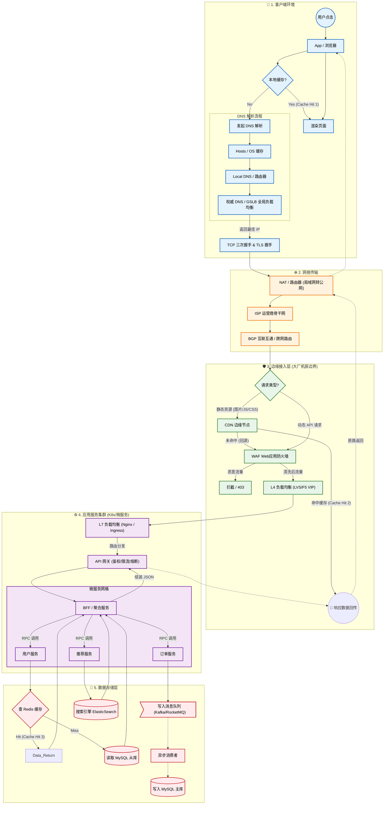

这是一个非常经典且宏大的面试题，也是理解现代互联网架构的最佳切入点。

为了让你清晰地看到全貌，我们将这个过程分为 **“客户端侧”、“网络传输侧”** 和 **“服务端侧”** 三个阶段，模拟一个用户在手机App上点击“刷新首页”的场景（假设目标是 `www.example.com`）。

---

### 第一阶段：客户端侧（出发前的准备）

在请求真正离开你的手机之前，操作系统和App内部已经发生了一场风暴。

#### 1. 应用层构建请求
*   **封装 HTTP 请求：** App 组装 HTTP 报文（Header, Body, Cookies, User-Agent 等）。
*   **缓存检查（App 级）：** App 会先检查本地是否有缓存（比如图片是否下载过，API 数据是否过期）。如果有且有效，直接渲染，流程结束（**Cache Hit 1**）。

#### 2. DNS 解析（寻找目的地的地图）
如果不知道服务器 IP，无法发送数据。DNS 解析流程如下：
1.  **浏览器/App 缓存：** 先看刚才查过没。
2.  **操作系统缓存（Hosts/DNS Cache）：** 查手机系统缓存。
3.  **本地 DNS 服务器（Local DNS）：** 请求发送到你连接的 WiFi 路由器或运营商提供的 DNS 服务器。
4.  **递归查询：** 如果 Local DNS 也没有，它会替你跑腿：
    *   问 **根域名服务器** -> 问 **.com 顶级域名服务器** -> 问 **example.com 权威域名服务器**。
5.  **GSLB（全局负载均衡）：** 大型互联网公司通常在 DNS 层面就做负载均衡。权威 DNS 会根据你的 IP 地址（比如你在北京），返回一个**离你最近的 CDN 节点 IP** 或者**最近的机房 VIP（虚拟 IP）**，而不是固定的某台机器 IP。

#### 3. 建立连接（TCP/TLS 握手）
拿到 IP 后，开始建立通信管道：
*   **TCP 三次握手：** 客户端与目标 IP 确认双方收发能力（SYN, SYN-ACK, ACK）。
*   **TLS/SSL 四次握手（HTTPS）：** 如果是 HTTPS（现在基本都是），还需要交换证书、验证身份、协商加密密钥。

---

### 第二阶段：网络传输侧（漫长的旅途）

数据包从你的手机网卡发出，进入茫茫互联网。

#### 4. 局域网与 NAT（走出家门）
*   **NAT（网络地址转换）：** 你的手机通常只有局域网 IP（如 192.168.x.x）。路由器会将你的源 IP 修改为运营商分配的公网 IP，并在路由表中记录映射关系，以便回包时能找到你。

#### 5. 运营商网络（ISP 的高速公路）
*   数据包经过光猫，进入 ISP（电信/联通/移动）的接入网。
*   经过城域网、骨干网，通过无数个路由器和交换机进行**路由跳转（Hop）**。
*   **BGP（边界网关协议）：** 如果跨运营商（如移动连电信），数据包会经过骨干网的互联互通节点。

---

### 第三阶段：服务端侧（迷宫般的处理）

数据包终于到达了大型互联网公司的基础设施边界。这里不是一台服务器，而是一个庞大的集群。

#### 6. 边缘层（CDN 与 防火墙）
*   **CDN（内容分发网络）：** 如果请求的是静态资源（图片、CSS、JS），请求会直接命中离你最近的 CDN 节点。CDN 缓存有数据则直接返回（**Cache Hit 2**），流程结束。
*   **WAF（Web 应用防火墙）：** 如果是动态请求，流量首先经过 WAF。它会清洗流量，拦截 SQL 注入、XSS 攻击、恶意爬虫等。

#### 7. 接入层（负载均衡）
*   **L4 LB（四层负载均衡）：** 通常是 LVS 或硬件防火墙（F5）。它只看 IP 和端口，利用 VIP（虚拟 IP）抗住海量并发，将流量分发给后端的七层负载均衡。
*   **L7 LB（七层负载均衡）：** 通常是 Nginx 或 HAProxy。它能看懂 HTTP 协议，根据 URL 路径（如 `/api/user` 或 `/api/order`）将请求路由到不同的后端服务集群。

#### 8. 网关层（API Gateway）
*   这是微服务的大门。
*   **功能：** 身份认证（校验 Token）、权限控制、限流（防止系统被压垮）、熔断降级、日志记录。

#### 9. 应用服务层（微服务处理）
请求终于到了具体的业务代码（Java/Go/Python 程序）。
*   **RPC 调用：** 一个请求可能需要调用多个微服务。例如“首页”服务可能需要调用“用户服务”拿头像，调用“推荐服务”拿商品列表，调用“广告服务”拿 Banner。
*   **服务发现：** 服务之间通过注册中心（如 Nacos, Consul）找到对方的 IP。

#### 10. 存储与缓存层（数据的归宿）
业务逻辑需要数据，会按顺序查找：
1.  **分布式缓存（Redis/Memcached）：** 先查缓存，速度极快。如果有数据，直接返回（**Cache Hit 3**）。
2.  **数据库（MySQL/PostgreSQL）：** 缓存没命中，查询主库或从库。
3.  **搜索引擎（Elasticsearch）：** 如果是搜索商品，会去查 ES。
4.  **消息队列（Kafka/RocketMQ）：** 如果是写操作（如下单），可能会先写入 MQ 进行异步处理，快速返回结果，防止阻塞。

---

### 第四阶段：返程（满载而归）

#### 11. 组装响应
*   各个微服务返回数据，聚合层将结果拼装成 JSON 或 HTML。
*   数据沿原路返回：应用 -> 网关 -> 负载均衡 -> 运营商 -> 路由器 -> 你的手机。

#### 12. 渲染展示
*   App 收到 HTTP 200 OK 响应。
*   解析 JSON，加载图片（可能再次触发上述 CDN 流程），将内容渲染在屏幕上。

---

### 总结：一张图看懂全流程

为了方便记忆，你可以把这个过程想象成**寄快递去大公司办事**：

1.  **打包（App）：** 准备好材料。
2.  **查地址（DNS）：** 查公司在哪个大厦。
3.  **小区大门（NAT）：** 门卫把你送出小区。
4.  **物流运输（ISP）：** 顺丰/邮政卡车在高速公路上跑。
5.  **公司收发室（CDN/WAF）：** 简单的东西直接拿走，危险品被拦截。
6.  **前台大厅（L4/L7 LB）：** 前台根据你要办的事，把你指引到不同楼层。
7.  **部门秘书（API Gateway）：** 查你的证件，看你有没有预约。
8.  **办事员（微服务）：** 具体处理业务。
9.  **档案室（DB/Cache）：** 办事员去查阅文件。
10. **返回结果：** 事情办完，回执单寄回给你。