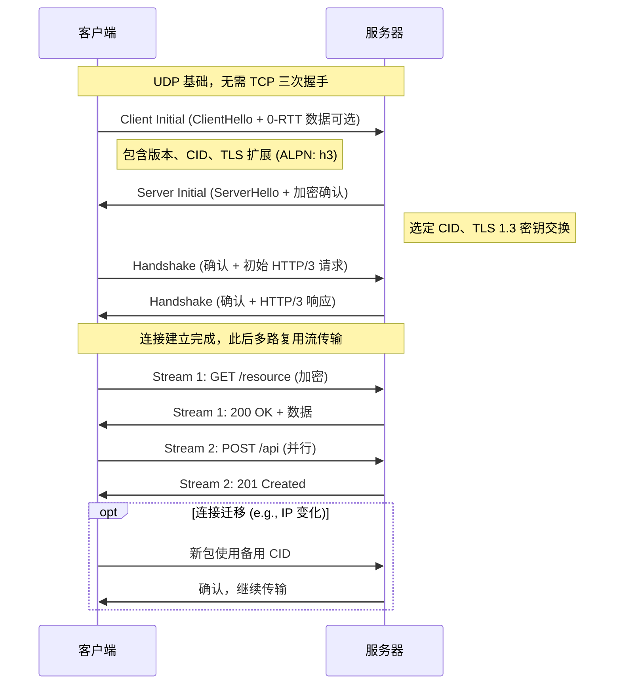

HTTP/3 是 Hypertext Transfer Protocol（超文本传输协议）的第三版标准，于 2022 年由 IETF（Internet Engineering Task Force）正式发布为 RFC 9114。作为 HTTP 协议的最新迭代，它彻底改变了底层传输机制，不再依赖 TCP，而是构建在 QUIC（Quick UDP Internet Connections）协议之上。QUIC 是一种基于 UDP 的多路复用传输协议，由 Google 在 2012 年提出，并于 2021 年标准化为 RFC 9000。HTTP/3 最初被称为 “HTTP over QUIC”，旨在解决 HTTP/2 在高延迟、移动网络和丢包场景下的性能瓶颈。截至 2025 年 12 月，HTTP/3 已在全球互联网流量中占比超过 30%，特别是在移动端和 CDN（如 Cloudflare、Akamai）中广泛部署。

#### 历史演进
- **HTTP 协议起源**：HTTP 于 1991 年以 HTTP/0.9 形式出现，仅支持简单的 GET 请求。1996 年的 HTTP/1.0 引入头字段和状态码，1997 年的 HTTP/1.1 添加持久连接和管道化，但仍受限于 TCP 的队头阻塞（Head-of-Line Blocking，HOL）。
- **HTTP/2 的出现**：2015 年发布（RFC 7540），引入二进制分帧、多路复用和头部压缩（HPACK），显著提升性能。但它仍依赖 TCP + TLS，导致在丢包或网络切换时效率低下。
- **QUIC 的诞生**：Google 于 2012 年启动 QUIC 项目，作为 SPDY（HTTP/2 前身）的继任者。2016 年，IETF 采纳 QUIC 并开始标准化。2021 年，QUIC 1.0 发布（RFC 9000），并与 HTTP/3 绑定。
- **HTTP/3 的标准化**：2018 年提案名为 “HTTP/2 Semantics over QUIC”，后更名为 HTTP/3。2022 年正式发布，已被 Chrome、Firefox、Safari 等主流浏览器支持。2025 年，HTTP/3 在 5G 和卫星网络（如 Starlink）中普及，推动了“全加密互联网”目标。

#### QUIC 协议概述
QUIC（发音为 “quick”）是一种通用传输层协议（Layer 4），旨在取代 TCP 的部分功能，但基于 UDP 以实现更低的延迟和更好的灵活性。不同于 TCP 的字节流模型，QUIC 支持多路复用流（Streams），每个流独立传输数据，避免单一丢包影响整个连接。

**核心设计原则**：
- **基于 UDP**：UDP 无连接、无序，但 QUIC 在用户空间实现了可靠性（重传、拥塞控制）、有序交付和加密。
- **集成 TLS 1.3**：QUIC 强制使用 TLS 1.3 进行加密和身份验证，将传输握手和加密握手合并为一步。
- **连接 ID（CID）**：使用随机生成的连接标识符（而非 IP + 端口四元组），支持连接迁移（如 Wi-Fi 到 5G 切换）。
- **版本协商**：QUIC 支持快速版本升级，而无需修改操作系统内核（如 TCP 的难题）。

#### HTTP/3 如何使用 QUIC
HTTP/3 是 QUIC 的第一个主要应用层协议（Application Layer）。它将 HTTP 的语义（方法、头、状态码）映射到 QUIC 的流上：
- **多路复用**：类似 HTTP/2，但 QUIC 的流独立于底层包丢失。
- **头部压缩**：使用 QPACK（RFC 9204），专为 QUIC 设计，支持动态表和静态表，减少冗余。
- **优先级和流控制**：HTTP/3 通过 QUIC 的信用系统（Credit-Based）精细控制流并发，避免 HTTP/2 的快速重置 DDoS 攻击。
- **加密要求**：所有 HTTP/3 连接默认加密，无法降级到明文。

HTTP/3 的协商无缝：客户端在 TLS 扩展（ALPN）中指定 “h3”，服务器确认后切换。

#### 关键特点
- **0-RTT（零往返时间）**：对于已连接的服务器，客户端可立即发送数据，无需握手（但受反放大攻击限制）。
- **连接迁移**：使用 CID 保持连接连续性，适合移动设备。
- **内置加密**：QUIC 加密元数据（如包号），防止中间人窥探用户行为。
- **拥塞控制扩展**：易于部署新算法（如 BBR），减少 ACK 包以节省 CPU。
- **安全性**：集成 TLS 1.3，支持前向保密（PFS），但不支持自签名证书。

#### 如何工作：连接建立与数据交换流程
QUIC 将 TCP 和 TLS 握手合并，典型新连接只需 1-RTT（相比 HTTP/2 的 3-RTT）。以下是 Mermaid 序列图展示的 QUIC/HTTP/3 连接流程：

- **连接建立**：客户端发送 Initial 包（包含 TLS ClientHello），服务器响应 Initial + Handshake。0-RTT 允许在新连接中立即发送应用数据（限 3x 接收数据大小防 DDoS）。
- **数据传输**：QUIC 使用帧（Frames）封装数据，支持 ACK、重传和流控制。每个 HTTP 请求/响应是一个独立流。
- **迁移**：IP 变化时，使用新 CID 继续，拥塞控制重置但不中断。

#### 优势与前版本比较
| 项目                  | HTTP/2 (TCP + TLS)          | HTTP/3 (QUIC)                        | 优势说明 |
|-----------------------|-----------------------------|--------------------------------------|----------|
| 连接延迟              | 3-RTT (TCP + TLS)           | 1-RTT (合并握手)，0-RTT (恢复)       | 减少 50-70% 延迟，尤其移动网络 |
| 队头阻塞              | 存在 (TCP 字节流)           | 无 (独立流)                          | 丢包不影响其他请求，提升并发 |
| 网络切换              | 中断 (IP 四元组绑定)        | 无缝 (CID)                           | 适合 5G/Wi-Fi 切换 |
| 加密                  | 可选 (TLS 外层)             | 强制内置 (TLS 1.3 + 元数据加密)     | 更安全，防窥探 |
| 拥塞控制              | 内核固定，难升级            | 用户空间，易扩展                     | 更快适应新算法 |
| DDoS 防护             | 易受 Rapid Reset 攻击       | 信用系统 + 反放大                    | 更鲁棒 |
| CPU 开销              | 较低                        | 较高 (UDP + 加密)，但优化中         | 权衡性能提升 |

HTTP/3 在高延迟链路（如卫星）上可提升 20-50% 速度，但需更多 CPU（预计 2025 年后优化）。

#### 技术细节与挑战
- **加密**：QUIC 加密几乎所有内容，仅 CID 暴露。使用 AEAD（Authenticated Encryption with Associated Data）保护包头。
- **性能改进**：减少 RTT、独立流和 QPACK 压缩（动态表防阻塞）。在丢包率 1% 的网络中，HTTP/3 加载时间可缩短 20%。
- **挑战**：UDP 易被中间盒（Middleboxes）阻塞（需端口 443），CPU 开销高（用户空间实现），不支持自签名证书（防篡改）。
- **部署现状**：2025 年，Chrome 支持率 100%，服务器如 Nginx 1.25+、Apache 2.4+ 已集成。未来将扩展到非 HTTP 应用（如 DNS over QUIC）。

HTTP/3 与 QUIC 标志着互联网传输的范式转变，推动更快的移动 web 和全加密时代。如果需要特定实现代码或工具演示，请进一步指定！