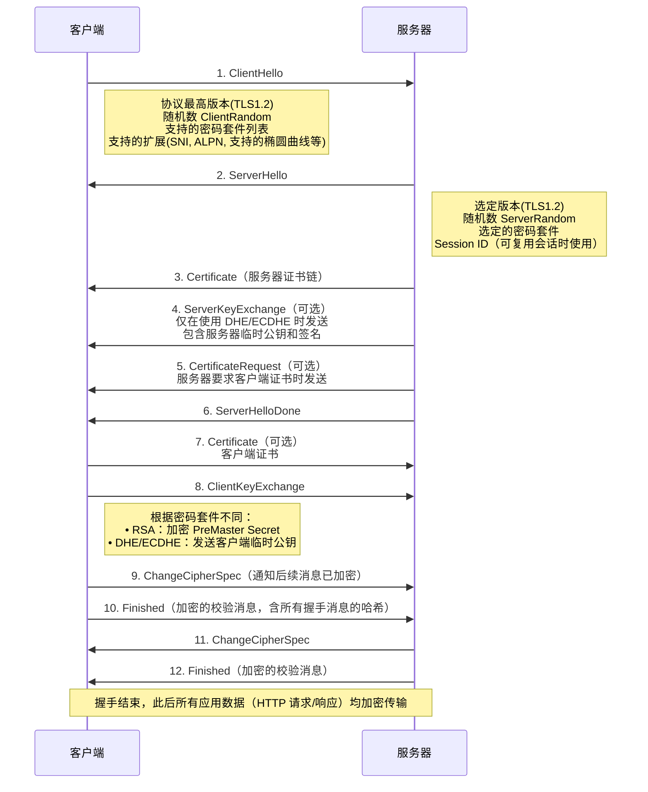
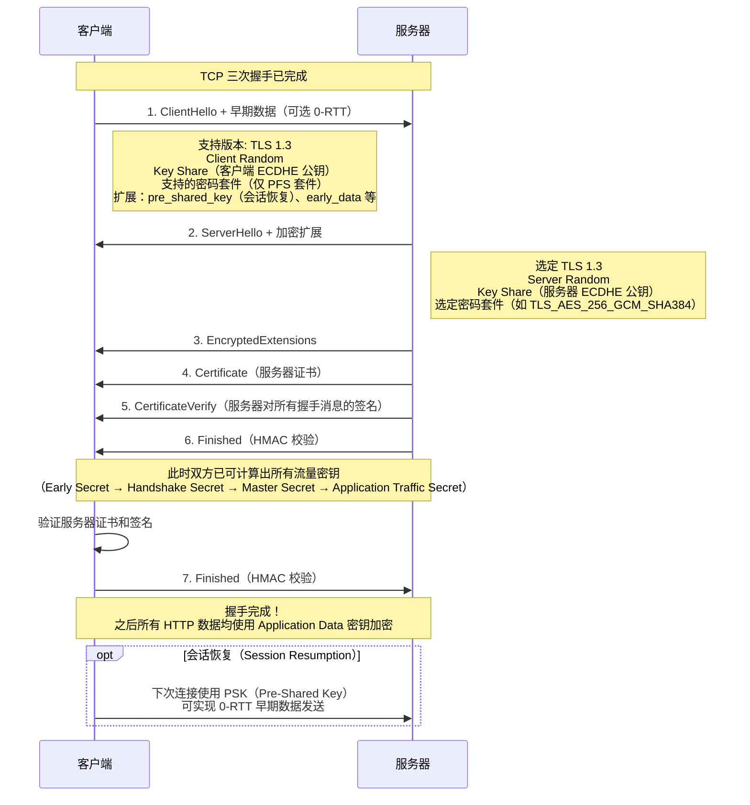

### TLS 握手过程完整详解（以主流的 TLS 1.2 和 TLS 1.3 为重点）

TLS 握手的目的是在客户端与服务器之间安全地协商出一套对称加密密钥，同时完成以下三件事：
1. 协商双方都支持的协议版本和加密算法（密码套件）
2. 完成服务器身份认证（有时也认证客户端）
3. 生成用于加密应用数据的会话密钥（Master Secret / Traffic Secret）

下面分别详细讲解 TLS 1.2 和 TLS 1.3 的握手流程（目前互联网 95%+ 的 HTTPS 流量已经使用 TLS 1.3）。

#### 一、TLS 1.2 握手（经典 2-RTT 握手，目前仍在大量使用）



**关键计算过程（TLS 1.2）**
1. 双方各自拥有：ClientRandom + ServerRandom + PreMaster Secret
2. 通过 PRF（伪随机函数，通常是 HMAC-SHA256）生成 Master Secret（48 字节）
3. 再从 Master Secret 扩展出 4 个密钥：
   - client_write_MAC_key
   - server_write_MAC_key
   - client_write_key（对称加密密钥）
   - server_write_key

**TLS 1.2 主要缺点**
- 往返次数多：2-RTT（不含 TCP 握手）
- 不支持 0-RTT
- 部分旧密码套件不提供前向保密（PFS）
- 握手消息明文传输（易被嗅探算法信息）

#### 二、TLS 1.3 握手（现代标准，已占主导地位）

TLS 1.3 彻底重构了握手流程，核心目标：
- 减少到 1-RTT（甚至 0-RTT 复用）
- 所有握手消息（除了最初的 ClientHello）都加密
- 强制前向保密（只允许 ECDHE/DHE）
- 去除旧的、不安全的加密算法



**TLS 1.3 密钥派生流程（HKDF + SHA-384）**
```
Early Secret
├── Handshake Secret（使用 ECDHE 共享密钥）
│   ├── Client Handshake Traffic Secret
│   ├── Server Handshake Traffic Secret
│   └── Derived Secret
└── Master Secret
    ├── Client Application Traffic Secret
    ├── Server Application Traffic Secret
    └── Resumption Master Secret（用于下次 PSK）
```

**TLS 1.3 的四大改进**
| 项目                | TLS 1.2                  | TLS 1.3                              |
|---------------------|--------------------------|--------------------------------------|
| 往返次数            | 2-RTT                    | 1-RTT（新连接）/ 0-RTT（复用）       |
| 握手消息是否加密    | 全部明文                 | 除了 ClientHello 外全部加密          |
| 前向保密            | 可选（看密码套件）       | 强制（只允许 ECDHE）                 |
| 支持 0-RTT          | 不支持                   | 支持（使用 PSK）                     |
| 密钥更新            | 不支持                   | 支持 KeyUpdate 消息，可随时轮换密钥  |
| 协商时间            | 约 200–400ms             | 通常 < 100ms                         |

#### 三、实际抓包看到的典型 TLS 1.3 握手（Wireshark 示例）
```
1. Client Hello          (明文，包含 key_share)
2. Server Hello           (明文，包含 key_share)
   ↳ 此时双方已经可以计算 handshake keys
3. Encrypted Extensions + Certificate + CertVerify + Finished  (全部加密)
4. Finished               (加密，来自客户端)
5. Application Data       (加密的 HTTP GET 请求立即发送)
```

#### 四、TLS 握手常见扩展（Extensions）
| 扩展名称               | 作用                                      |
|------------------------|-------------------------------------------|
| server_name (SNI)      | 虚拟主机支持，告诉服务器要访问哪个域名    |
| ALPN                   | 协商应用层协议（如 h2 表示 HTTP/2）       |
| supported_groups       | 支持的椭圆曲线（x25519, secp256r1 等）    |
| key_share              | 提前发送 ECDHE 公钥（TLS 1.3 关键）       |
| pre_shared_key         | 会话票据（Session Ticket）或 PSK 恢复     |
| early_data             | 声明支持 0-RTT                            |
| signature_algorithms   | 支持的签名算法（rsa-pkcs1-sha256, ecdsa-secp256r1-sha256 等） |

#### 五、总结对比表

| 特性                  | TLS 1.2                              | TLS 1.3                              |
|-----------------------|--------------------------------------|--------------------------------------|
| 首次连接延迟          | 2-RTT + TCP 握手 ≈ 3-RTT             | 1-RTT + TCP 握手 ≈ 2-RTT             |
| 恢复连接延迟          | 1-RTT（Session ID/Ticket）           | 0-RTT（PSK + early data）            |
| 安全性                | 依赖密码套件，有非 PFS 选项          | 强制 PFS，所有握手消息（几乎）加密   |
| 性能                  | 一般                                 | 显著提升（尤其移动网络）             |
| 互联网占比（2025年）  | < 5%                                 | > 95%                                |

这就是目前最详细、最实用的 TLS 握手过程说明。实际部署中，强烈推荐强制使用 TLS 1.3 + ECDHE + AES-256-GCM 或 ChaCha20-Poly1305 组合。