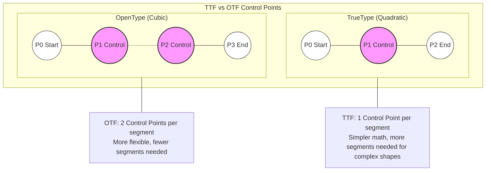

这是一个关于贝塞尔曲线（Bézier Curves）及其在字体技术中应用的详细技术文档。

---

# 贝塞尔曲线 (Bézier Curves) 技术详解

## 1. 定义与背景
贝塞尔曲线是一种参数化曲线，广泛应用于计算机图形学（Computer Graphics）中，用于对平滑曲线进行数学建模。

*   **起源**：虽然数学原理最早由 Paul de Casteljau 于 1959 年发现，但它因法国工程师 **Pierre Bézier** 而得名。他在 1962 年将其应用于雷诺汽车（Renault）的车身设计。
*   **核心特性**：它通过一组“控制点”（Control Points）来定义曲线的形状。曲线起始于第一个点，结束于最后一个点，而中间的点（控制点）像磁铁一样吸引曲线，但不一定穿过曲线。

## 2. 核心机制：如何描绘矢量图形

贝塞尔曲线是矢量图形（Vector Graphics）的基石。与像素图（Raster）不同，矢量图记录的是数学公式而非像素点阵，因此可以无限放大而不失真。

### 2.1 控制点系统
绘制贝塞尔曲线的过程就是定义控制点的过程：
1.  **锚点 (Anchors)**：曲线的起点 $P_0$ 和终点 $P_n$。曲线必须经过这两个点。
2.  **控制手柄 (Handles)**：中间的点 $P_1, P_2...$。它们决定了曲线的切线方向和弯曲程度。
    *   连接起点和第一个控制点的线段，是曲线在起点的**切线**。
    *   连接终点和最后一个控制点的线段，是曲线在终点的**切线**。

### 2.2 德卡斯特里奥算法 (De Casteljau's Algorithm)
这是计算机绘制贝塞尔曲线的几何直观方法。
*   假设要在 $t$ 时刻（$t$ 从 0 到 1）找到曲线上的点。
*   算法会在每两个相邻控制点的连线上，找到一个比例为 $t$ 的点。
*   连接这些新点，重复上述过程，直到只剩下一个点。这个点就是曲线在 $t$ 时刻的位置。
*   随着 $t$ 从 0 变到 1，这个点的轨迹就形成了曲线。

## 3. 贝塞尔曲线的阶数 (Order)

曲线的复杂度和控制点的数量直接相关。

### 3.1 线性贝塞尔 (Linear) - 1阶
*   **控制点**：2个 ($P_0, P_1$)。
*   **形状**：就是一条直线。
*   **公式**：$B(t) = P_0 + t(P_1 - P_0)$

### 3.2 二阶贝塞尔 (Quadratic) - 2阶
*   **控制点**：3个 ($P_0, P_1, P_2$)。
*   **形状**：抛物线片段。有一个控制点 $P_1$ 拉扯曲线。
*   **应用**：**TrueType Font (TTF)** 字体格式。

### 3.3 三阶贝塞尔 (Cubic) - 3阶
*   **控制点**：4个 ($P_0, P_1, P_2, P_3$)。
*   **形状**：可以形成“S”形弯曲。有两个控制点 $P_1, P_2$ 分别控制起点和终点的曲率。
*   **应用**：**PostScript** 和 **OpenType Font (OTF/CFF)** 字体格式，以及 Adobe Illustrator 等绘图软件。

---

## 4. 字体技术中的应用：TTF vs OTF

在数字排版领域，字体文件本质上是字形轮廓（Glyph Outlines）的数据库。不同的字体格式使用了不同阶数的贝塞尔曲线。

### 4.1 TrueType Font (TTF)
*   **使用的曲线**：**二阶贝塞尔曲线 (Quadratic Bézier Curves)**。
*   **工作原理**：
    *   由一系列点定义轮廓。
    *   点分为“线上点”（On-curve points，即锚点）和“线外点”（Off-curve points，即控制点）。
    *   **隐含点规则**：如果在 TTF 数据流中连续出现两个“线外点”，渲染引擎会自动在它们的中点创建一个虚拟的“线上点”。这是一种数据压缩技巧。
*   **优缺点**：
    *   **优点**：计算速度极快（数学上更简单），适合早期的低性能处理器。
    *   **缺点**：描述复杂曲线（如复杂的衬线字体）效率较低，需要更多的点来模拟平滑曲线。

### 4.2 OpenType Font (OTF) / PostScript (CFF)
*   **使用的曲线**：**三阶贝塞尔曲线 (Cubic Bézier Curves)**。
*   **工作原理**：
    *   使用两个锚点和两个控制点来定义一段曲线。
    *   能够更自由地控制切线方向和长度。
*   **优缺点**：
    *   **优点**：更精确，能用更少的点描述复杂的形状，文件体积通常更小（对于复杂轮廓）。
    *   **缺点**：光栅化（Rasterization）时的计算量比二阶曲线稍大（但在现代硬件上可忽略不计）。

### 4.3 视觉对比示意图

下面的图表展示了 TTF（二阶）和 OTF（三阶）在描述同一段弧线时的区别。

## 5. 总结：它们如何工作

1.  **数学插值**：无论是 TTF 还是 OTF，计算机都不存储曲线的图像，只存储关键点的坐标 $(x, y)$。
2.  **渲染引擎**（如 Windows 的 DirectWrite, macOS 的 Quartz, 或 FreeType 库）：
    *   读取字体文件中的坐标点。
    *   将 $t$ 从 0 到 1 代入贝塞尔公式。
    *   计算出成千上万个微小的点。
    *   将这些点连接起来形成轮廓。
    *   **填充 (Scan Conversion)**：判断哪些像素在轮廓内部，将其染成黑色（或字体颜色）。

**简而言之：**
*   **TTF (二阶)** 就像你拉着一根橡皮筋的中间（1个控制点）把它拉弯。
*   **OTF (三阶)** 就像你用两只手分别捏住橡皮筋的两个位置（2个控制点），可以扭出更复杂的“S”形。