这是一个非常经典且复杂的计算机图形学与工程问题。将一个 Markdown 文档渲染为最终的位图（Bitmap），实际上跨越了从**应用层（解析）**到**排版引擎（布局）**再到**渲染引擎（光栅化）**的完整流程。

现代文字排版渲染系统（如浏览器内核 Blink/Webkit、游戏引擎 Unity/Unreal、或操作系统层 CoreText/DirectWrite）通常遵循一个分层流水线架构。

以下是将一个 MD 文档渲染为位图的完整架构流程图及详细解析：

### 1. 核心架构流水线 (Mermaid Diagram)

```mermaid
graph TD
    %% 定义样式
    classDef input fill:#e1f5fe,stroke:#01579b,stroke-width:2px;
    classDef process fill:#fff9c4,stroke:#fbc02d,stroke-width:2px;
    classDef data fill:#e8f5e9,stroke:#2e7d32,stroke-width:2px;
    classDef engine fill:#f3e5f5,stroke:#7b1fa2,stroke-width:2px;

    %% 输入阶段
    Input["Markdown Source Text"]:::input --> Parser["Parser (Markdown Parser)"]:::process
    Parser --> AST["Abstract Syntax Tree (AST)"]:::data
    
    %% 样式计算阶段
    AST --> StyleCalc["Style Calculation"]:::process
    StyleCalc --> StyledTree["Render Tree / Styled Text"]:::data
    
    %% 文本处理核心 (Text Shaping)
    subgraph Text_Processing ["Text Processing Engine (e.g., HarfBuzz, ICU)"]
        direction TB
        StyledTree --> Itemization["Itemization (Script/Lang/Direction Analysis)"]:::engine
        Itemization --> FontSelection["Font Selection / Fallback"]:::engine
        FontSelection --> Shaping["Shaping (Glyph Selection & Positioning)"]:::engine
        Shaping --> GlyphBuffer["Glyph Buffer (Glyph IDs + Positions)"]:::data
    end

    %% 排版布局阶段 (Layout)
    subgraph Layout_Engine ["Layout Engine (e.g., Yoga, Blink Layout)"]
        direction TB
        GlyphBuffer --> LineBreaking["Line Breaking (Knuth-Plass or Greedy)"]:::engine
        LineBreaking --> BidiReorder["BiDi Reordering (Unicode Bidirectional Algo)"]:::engine
        BidiReorder --> BoxModel["Box Model & Positioning (x, y coordinates)"]:::engine
    end

    %% 渲染光栅化阶段 (Rasterization)
    subgraph Rendering_Engine ["Rendering Engine (e.g., Skia, FreeType, GPU)"]
        direction TB
        BoxModel --> GlyphLoading["Glyph Outline Loading (Bezier Curves)"]:::engine
        GlyphLoading --> Rasterization["Rasterization (Scanline / SDF / GPU Compute)"]:::engine
        Rasterization --> Atlas["Texture Atlas / Cache"]:::data
        Atlas --> Compositing["Compositing & Blending"]:::engine
    end

    %% 输出
    Compositing --> Bitmap["Final Bitmap / Screen Buffer"]:::input
```

---

### 2. 详细步骤解析

这个过程可以分为四个主要阶段：**解析与样式**、**文本塑形 (Shaping)**、**布局 (Layout)**、**渲染 (Rendering)**。

#### 第一阶段：解析与结构化 (Parsing & Styling)
*   **输入：** 原始 Markdown 文本（例如 `# Hello **World**`）。
*   **解析 (Parsing)：** 使用解析器（如 `markdown-it` 或 `CommonMark`）将文本转换为 **AST (抽象语法树)**。
    *   *例子：* 识别出 `Hello` 是 H1 标题，`World` 是 H1 标题下的加粗文本。
*   **样式计算 (Style Calculation)：** 遍历 AST，为每个节点附加样式属性（字体族、字号、颜色、行高）。
    *   *结果：* 生成一个带有样式信息的文本流（Styled Text Runs）。

#### 第二阶段：文本塑形 (Text Shaping) —— 最复杂的隐形步骤
这是现代排版系统与简单文本输出的区别所在。计算机不能直接把字符（Character）画出来，必须先转换成字形（Glyph）。
*   **分段 (Itemization)：** 将文本流切分成具有相同属性（语言、书写方向、字体）的微小片段（Runs）。
    *   *处理：* 混合排版（如中文夹杂阿拉伯文）需要在此阶段确定是从左向右（LTR）还是从右向左（RTL）。
*   **字体回退 (Font Fallback)：** 如果首选字体（如 Helvetica）不包含“你好”这两个字，系统需要自动寻找包含这些字的备用字体（如 PingFang SC）。
*   **塑形 (Shaping)：** 使用引擎（如 **HarfBuzz**）将 Unicode 字符转换为字体文件中的 **Glyph ID** 和 **相对位移**。
    *   *连字 (Ligatures)：* 将 `f` 和 `i` 替换为 `fi` 连字字形。
    *   *字距调整 (Kerning)：* 调整 `A` 和 `V` 之间的距离，使视觉更紧凑。
    *   *复杂文字：* 处理阿拉伯文或印地文的变形规则。

#### 第三阶段：布局 (Layout / Typesetting)
有了字形和它们的大小，现在需要决定它们在页面上的确切位置。
*   **换行 (Line Breaking)：** 决定一行能放下多少个字。
    *   *算法：* 简单系统使用贪心算法；高级系统（如 TeX）使用 Knuth-Plass 算法，通过最小化“惩罚值”来寻找整段最优换行点。
    *   *断词：* 处理英文单词跨行时的连字符（Hyphenation）。
*   **双向重排 (BiDi Reordering)：** 根据 Unicode 双向算法，调整同一行内不同书写方向文字的视觉顺序。
*   **几何计算：** 计算每个字形相对于文档原点的最终 `(x, y)` 坐标，生成最终的 **Render Object Tree**。

#### 第四阶段：光栅化与合成 (Rasterization & Compositing)
将数学上的矢量坐标和贝塞尔曲线转换为像素。
*   **字形加载：** 从字体文件（.ttf/.otf）中读取字形的轮廓数据（贝塞尔曲线）。通常使用 **FreeType**。
*   **光栅化 (Rasterization)：**
    *   **CPU 方式：** 使用扫描线算法（Scanline）计算曲线覆盖了哪些像素，生成灰度图（用于抗锯齿）。
    *   **GPU 方式：** 现代高性能渲染常使用 **SDF (Signed Distance Field)** 或直接在 Compute Shader 中进行路径渲染（如 Pathfinder）。
*   **缓存 (Caching/Atlas)：** 光栅化非常耗时，系统会将渲染好的字形（如字母 'A'）存入一张巨大的纹理图（Texture Atlas）中，下次直接复用。
*   **合成 (Compositing)：** 将字形纹理从 Atlas 复制到最终的位图缓冲区，并进行颜色混合（Gamma 校正、Subpixel Rendering/LCD 抗锯齿）。

### 3. 关键技术栈举例

如果你要自己实现或研究这个架构，通常会接触以下库：

| 模块 | 工业界标准库 (C/C++) | Web/JS 生态 |
| :--- | :--- | :--- |
| **解析** | cmark | remark, markdown-it |
| **文本分析 (Unicode)** | **ICU** (International Components for Unicode) | Intl API |
| **文本塑形 (Shaping)** | **HarfBuzz** (Chrome, Android, Firefox 都在用) | harfbuzzjs |
| **字体解析** | **FreeType** | opentype.js |
| **2D 渲染引擎** | **Skia** (Chrome, Flutter), Cairo | Canvas API, WebGL |
| **布局引擎** | **Yoga** (Flexbox), Pango | Browser Native |

### 总结
将 MD 渲染为位图，本质上是一个**从语义（Markdown）到矢量（Glyph Outline）再到像素（Bitmap）的数据降维过程**。其中最困难的部分通常不在于画出像素，而在于**Shaping（如何正确选择字形）**和**Layout（如何优雅地放置字形）**。