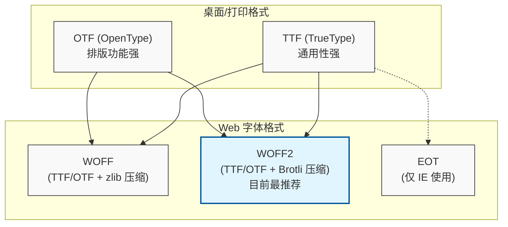

常见的字体文件格式主要分为两大类：**桌面/打印字体**（用于设计软件、文档打印）和**Web 字体**（用于网页加载）。

以下是目前最主流的字体格式及其核心区别的详细对比：

### 1. 核心格式概览

| 格式名称 | 全称 | 扩展名 | 主要用途 | 特点总结 |
| :--- | :--- | :--- | :--- | :--- |
| **TTF** | TrueType Font | `.ttf` | 桌面安装、老旧网页 | 兼容性最强，但文件体积较大。 |
| **OTF** | OpenType Font | `.otf` | 高端排版、平面设计 | 支持高级排版特性（连字、分数等），曲线更平滑。 |
| **WOFF** | Web Open Font Format | `.woff` | 网页设计 (Web) | 专为网页压缩优化，加载速度快。 |
| **WOFF2** | Web Open Font Format 2 | `.woff2` | 现代网页设计 (Web) | WOFF 的升级版，压缩率更高，目前网页首选。 |
| **SVG** | Scalable Vector Graphics | `.svg` | 极少数旧iOS设备 | 基于矢量的文本，文件极大，已被淘汰。 |
| **EOT** | Embedded OpenType | `.eot` | 旧版 IE 浏览器 | 微软专用格式，仅用于兼容 IE6-IE8。 |

---

### 2. 详细区别与技术解析

#### A. TTF (TrueType Font) —— "老牌通用标准"
*   **历史背景：** 由 Apple 和 Microsoft 在 80 年代联合开发，旨在打破 Adobe 对字体技术的垄断。
*   **技术原理：** 使用二次贝塞尔曲线（Quadratic Bezier curves）来描述轮廓。
*   **优点：**
    *   **兼容性无敌：** 几乎所有的操作系统（Windows, macOS, Linux）和大多数应用程序都能直接读取。
    *   **屏幕显示优化：** 包含 Hinting（微调）信息，在低分辨率屏幕上显示依然清晰。
*   **缺点：** 文件体积通常比 OTF 稍大，且不支持某些高级排版功能。

#### B. OTF (OpenType Font) —— "设计师的首选"
*   **历史背景：** 由 Adobe 和 Microsoft 联合开发，是 TTF 的进化版。
*   **技术原理：** 既可以包含 TrueType 数据，也可以包含 PostScript 数据（使用三次贝塞尔曲线，Cubic Bezier curves）。
*   **优点：**
    *   **高级排版特性：** 支持连字（Ligatures）、旧式数字、小型大写字母、多语言字符集（一个文件可包含 65,000+ 字符）。
    *   **曲线更精细：** 三次贝塞尔曲线能更精准地描述复杂的字体笔画。
*   **区别点：** 如果你做平面设计（InDesign, Illustrator），首选 OTF；如果你只是办公打字，TTF 足够。

#### C. WOFF / WOFF2 (Web Open Font Format) —— "网页加载的王者"
*   **本质：** 它们本质上是 **TTF 或 OTF 的压缩容器**，并添加了元数据（Metadata）。
*   **WOFF (v1)：** 使用 zlib 压缩，比原始 TTF/OTF 小很多，专为网络带宽优化。
*   **WOFF2 (v2)：** 使用 Brotli 压缩算法，比 WOFF v1 还能再小 30%~50%。
*   **优点：** 加载速度极快，且包含版权信息（防止被随意下载安装到桌面使用，因为桌面系统通常不直接支持安装 WOFF）。
*   **最佳实践：** 现代网站开发通常只需提供 WOFF2（主流浏览器）和 WOFF（兼容旧浏览器）即可。

#### D. EOT & SVG —— "时代的眼泪"
*   **EOT：** 微软为了在 IE 浏览器上保护字体版权搞出来的私有格式。现在除了为了兼容 IE8 以下的古董浏览器，几乎不再使用。
*   **SVG Fonts：** 早期 iOS Safari 不支持其他格式时使用的方案。它其实是 XML 文本，体积巨大且不支持字体微调（Hinting），现在已被完全淘汰。

---

### 3. 总结与建议

*   **如果你是平面设计师：**
    *   首选 **OTF**。它能提供最丰富的字形变化和最细腻的线条。
*   **如果你是普通办公用户：**
    *   **TTF** 和 **OTF** 都可以，哪个能装上用哪个，区别不大。
*   **如果你是前端开发人员 (Web Developer)：**
    *   首选 **WOFF2**（覆盖 95% 现代浏览器）。
    *   备选 **WOFF**（作为回退方案）。
    *   除非客户强制要求兼容 IE8，否则不要使用 EOT。
    *   除非为了兼容极老的 Android/iOS，否则不要使用 TTF/SVG 作为 Web 字体。

### 4. 格式关系图解

