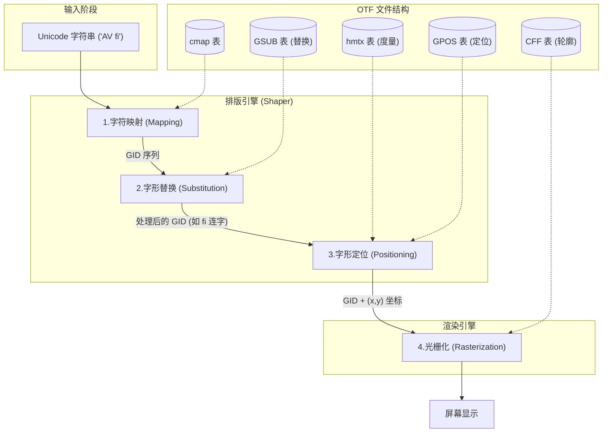

OpenType Font (OTF) 是一种跨平台的字体文件格式，由 Adobe 和 Microsoft 共同开发。它本质上是一个容器（Wrapper），基于 Apple 的 TrueType `sfnt` 结构，但扩展了对 PostScript (CFF) 轮廓数据和高级排版功能的支持。

以下是对 OTF 文件内部结构的详细拆解，以及排版引擎（如 HarfBuzz, CoreText, DirectWrite）如何利用这些数据进行文字渲染的流程。

---

### 第一部分：OTF 文件的内部结构

OTF 文件并非一个单一的数据块，而是一个由多个**表（Tables）**组成的数据库。文件头是一个目录，指向各个表在文件中的位置。

#### 1. 核心容器结构 (The `sfnt` Wrapper)
*   **Offset Table (偏移表):** 文件的入口。它记录了文件中有多少个表，以及每个表（Table）的标签（Tag）、校验和（Checksum）、偏移量（Offset）和长度（Length）。
*   **Table Directory:** 紧随偏移表之后，解析器通过它快速定位到具体的表。

#### 2. 轮廓数据表 (Glyph Outlines) —— OTF 的核心特征
这是 `.otf` (CFF flavor) 与 `.ttf` (TrueType flavor) 的主要区别：
*   **`CFF ` / `CFF2` (Compact Font Format):**
    *   存储字形的几何轮廓。
    *   使用的是 **三次贝塞尔曲线 (Cubic Bézier curves)**，这与 PostScript 语言一致。
    *   相比 TrueType 的二次贝塞尔曲线，三次曲线能用更少的控制点描述更复杂的形状，且文件体积通常更小。
    *   *注：如果是 TrueType 风格的 OpenType，这里会是 `glyf` 和 `loca` 表。*

#### 3. 字符映射表 (Mapping)
*   **`cmap` (Character to Glyph Index Mapping):**
    *   这是最重要的表之一。它将字符编码（通常是 Unicode）映射到字体内部的 **字形索引 (Glyph ID / GID)**。
    *   例如：Unicode `U+0041` ("A") -> GID `35`。

#### 4. 度量与元数据表 (Metrics & Metadata)
*   **`head` (Font Header):** 全局信息，如版本号、创建时间、字体的边界框（Bounding Box）、em square 大小（通常是 1000 或 2048）。
*   **`hhea` (Horizontal Header):** 水平排版的全局度量，如上升部（Ascender）、下降部（Descender）、行距（Line Gap）。
*   **`hmtx` (Horizontal Metrics):** 记录每个 GID 的**预推宽度 (Advance Width)** 和 **左侧白 (Left Side Bearing)**。这是决定文字基本间距的关键。
*   **`name`:** 存储人类可读的字符串，如字体名称、版权信息、设计师名字等。
*   **`OS/2`:** Windows 特定的度量信息，包括字重（Weight）、字宽（Width Class）以及上下标位置等。

#### 5. 高级排版表 (Advanced Layout Tables) —— OTL
这是 OpenType "智能" 的来源，用于处理复杂的语言脚本（如阿拉伯文、天城文）和高级西文排版。
*   **`GSUB` (Glyph Substitution):** **替换**规则。
    *   例如：连字（Ligatures，将 "f" 和 "i" 替换为 "fi" 连字字形）、旧式数字、小型大写字母。
*   **`GPOS` (Glyph Positioning):** **定位**规则。
    *   例如：字距调整（Kerning，调整 "A" 和 "V" 之间的距离）、变音符号的位置（Mark-to-Base positioning）。
*   **`GDEF` (Glyph Definition):** 将字形分类（如：基础字符、连字、变音符号），帮助 `GSUB` 和 `GPOS` 正确匹配。
*   **`BASE`:** 定义不同文字系统的基线对齐方式（例如汉字与拉丁字母混排时的基线对齐）。

---

### 第二部分：排版系统如何使用这些结构

当你在 Word、浏览器或设计软件中输入一段文字时，**排版引擎（Shaping Engine）**（如 HarfBuzz）和 **光栅化引擎**（如 FreeType）会按以下流水线工作：

#### 步骤 1：字符解码与映射 (Mapping)
1.  **输入:** 文本字符串（Unicode 序列），例如 `"AV fi"`.
2.  **操作:** 引擎读取 **`cmap`** 表。
3.  **过程:** 查找 `U+0041` (A), `U+0056` (V), `U+0020` (space), `U+0066` (f), `U+0069` (i)。
4.  **输出:** 初始的字形索引序列 (GIDs)，例如 `[10, 25, 3, 40, 45]`。

#### 步骤 2：字形替换 (Substitution - Shaping)
这是 "Shaping" 的核心阶段，引擎会检查 **`GSUB`** 表。
1.  **输入:** GID 序列 `[10, 25, 3, 40, 45]`.
2.  **特征应用:** 用户开启了 "标准连字" (liga) 功能。
3.  **查找:** 引擎在 `GSUB` 中查找规则：当 GID `40` (f) 后跟 GID `45` (i) 时，替换为 GID `102` (fi 连字)。
4.  **输出:** 新的 GID 序列 `[10, 25, 3, 102]`.

#### 步骤 3：字形定位 (Positioning)
引擎确定每个字形在屏幕上的确切 `(x, y)` 坐标。
1.  **基础宽度:** 读取 **`hmtx`** 表，获取每个 GID 的标准预推宽度（Advance Width）。此时文字是按标准间距排列的。
2.  **高级调整:** 引擎读取 **`GPOS`** 表。
    *   **Kerning (字距):** 发现 GID `10` (A) 和 GID `25` (V) 相邻。`GPOS` 规则指出：这对组合间距应减少 50 单位。
    *   **Mark Positioning:** 如果有变音符号，`GPOS` 会根据锚点（Anchor points）计算其相对于基字符的偏移量。
3.  **输出:** 每个字形的最终位置坐标和步进距离。

#### 步骤 4：轮廓提取与光栅化 (Rasterization)
一旦确定了显示哪个字形（GID）以及显示在哪里（x, y），就需要画出它们。
1.  **读取轮廓:** 渲染引擎读取 **`CFF`** 表。
2.  **解析曲线:** 解析三次贝塞尔曲线数据。
3.  **网格对齐 (Hinting):** 如果字号较小，引擎会利用 CFF 中的 Hinting 数据（或自动 Hinting）微调轮廓以对齐像素网格，防止模糊。
4.  **填充像素:** 将数学轮廓转换为屏幕上的像素点（位图）。

### 总结流程图

为了直观理解，以下是该流程的 Mermaid 示意图：

### 总结
OTF 文件不仅仅是图片的集合，它是一个包含逻辑的程序。**`cmap`** 负责翻译语言，**`GSUB`** 和 **`GPOS`** 负责排版的美学和语言规则，**`hmtx`** 提供物理尺寸，而 **`CFF`** 提供最终的视觉形状。排版系统正是通过按顺序查询这些表，将抽象的字符代码转化为美观的视觉排版。